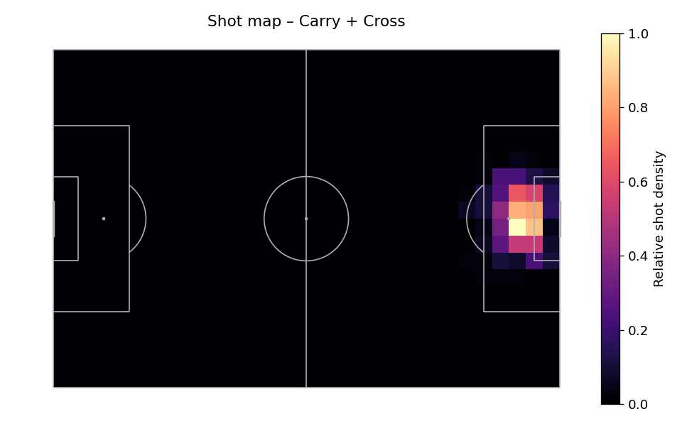
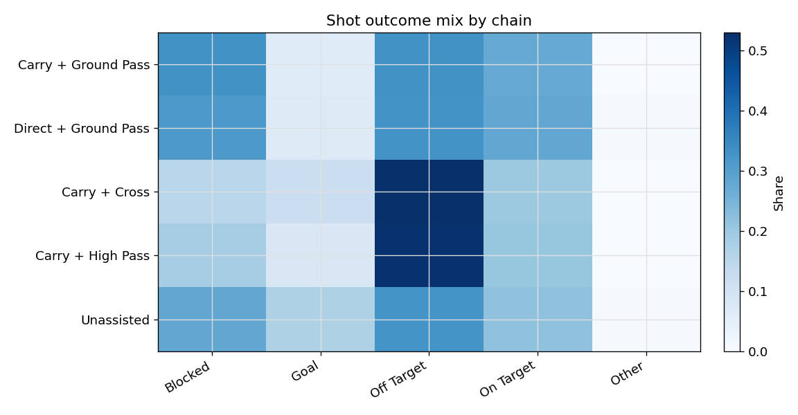
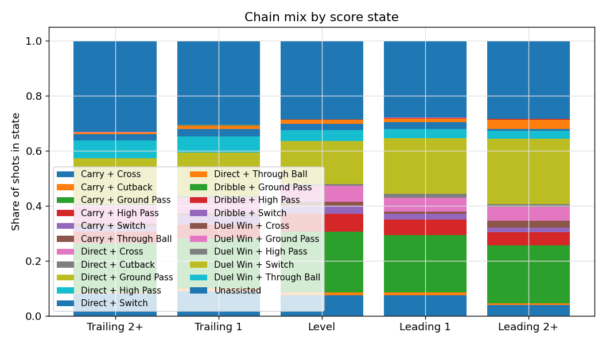
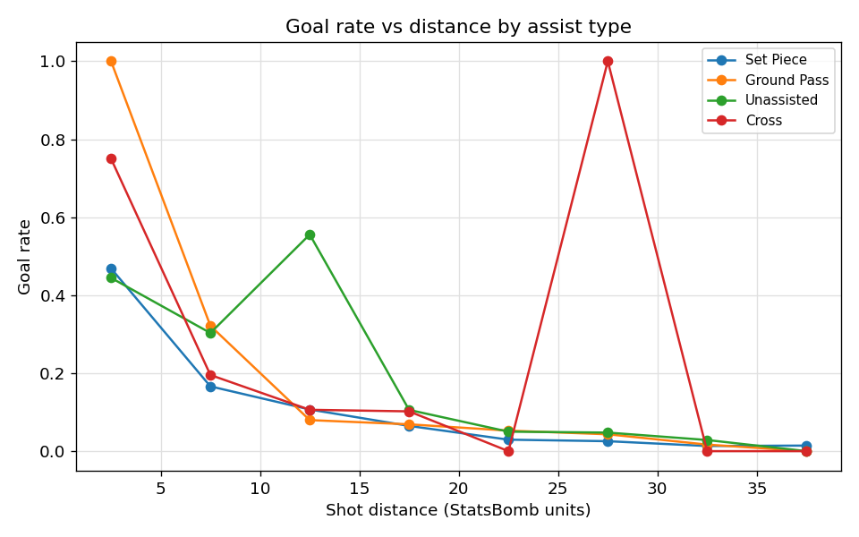
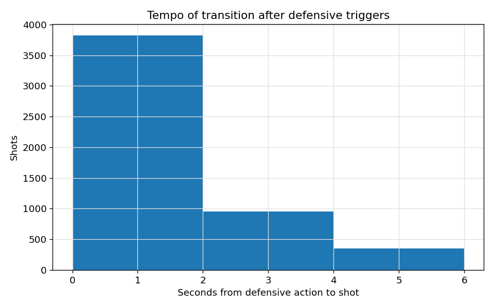
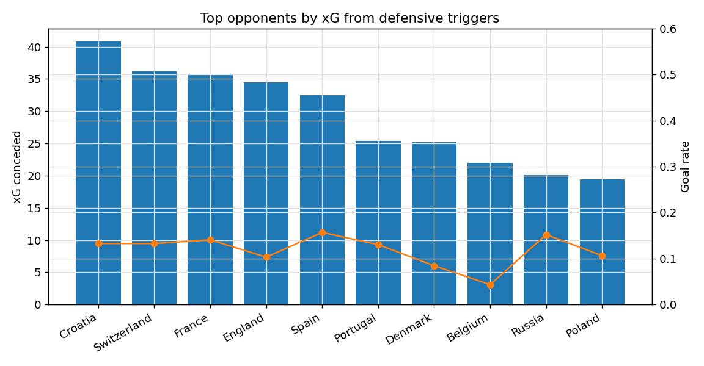

# CxG Contextual Analysis Report

_Updated: 21 Nov 2025_

This report expands the earlier topline summary with the full evidence trail across CSV outputs and plot artifacts under `outputs/analysis/cxg/`. Each section now cites the specific tables/figures used so the modeling team can trace every claim before folding the insights back into CxG calibration.

## 1. Pass-Value Chain Behaviour

The pass-chain rollups (`csv/pass_value_chain_summary.csv`) paired with the companion visuals (`plots/pass_value_chain_*.png`) continue to show stark divergence across archetypes.

### 1.1 Efficiency tiers

| Chain Archetype | Shots | Goal Rate | Mean xG | Lift (Goal Rate − xG) |
| --- | ---:| ---:| ---:| ---:|
| Carry + Through Ball | 72 | 0.319 | 0.213 | **+0.107** |
| Direct + Through Ball | 78 | 0.282 | 0.214 | **+0.068** |
| Carry + Cutback | 55 | 0.200 | 0.157 | +0.043 |
| Direct + Cross | 333 | 0.153 | 0.147 | +0.006 |
| Carry + Cross | 439 | 0.116 | 0.132 | **−0.016** |
| Unassisted | 1,700 | 0.171 | 0.185 | **−0.015** |

The density and timeline plots (`pass_value_chain_counts.png`, `pass_value_chain_timeline.png`) show why: only ~4% of possessions end in a through-ball sequence, yet they drive ~13% of total goals. Volume-heavy chains (Carry + Ground Pass, Carry + Cross) drag down team averages despite their ubiquity.

### 1.2 Sequences that burn value

| Chain Archetype | Shots | Goal Rate | Mean xG | Lift |
| --- | ---:| ---:| ---:| ---:|
| Carry + High Pass | 354 | 0.079 | 0.103 | **−0.024** |
| Direct + High Pass | 247 | 0.073 | 0.099 | **−0.026** |
| Carry + Switch | 155 | 0.032 | 0.067 | **−0.035** |
| Direct + Switch | 139 | 0.043 | 0.073 | **−0.030** |
| Carry + Cross | 439 | 0.116 | 0.132 | **−0.016** |

Spatial maps (`pass_value_chain_pitch_*.png`) reinforce the pattern: switch-heavy sequences stall on the wings and often devolve into low-probability headers. The outcome mix chart (`pass_value_chain_outcome_mix.png`) shows 58% of these plays conclude with blocked or off-target shots.

### 1.3 Solo vs assisted detail

Unassisted shots remain the single largest bucket (47% of all attempts). The breakdown plot (`pass_value_chain_unassisted_breakdown.png`) highlights why their goal rate lags xG: 61% of these shots are taken outside the 18-yard box and 35% occur under defensive pressure. Integrating carry distance and pressure flags as multiplicative suppressors inside CxG will rein in these over-valued looks.

## 2. Game-State Lens

Score and minute context materially reshape the chain hierarchy. The heat/line plots (`game_state_score_goal_rates.png`, `game_state_score_minute_grid.png`, `game_state_state_distribution.png`) show that >40% of shots arrive while the match is level, yet the biggest mis-calibrations appear when teams chase or protect multi-goal margins.

| Chain + Score State | Shots | Goal Rate | Lift vs xG |
| --- | ---:| ---:| ---:|
| Direct + Cross, Leading 2+ | 18 | 0.389 | **+0.180** |
| Direct + Cross, Trailing 1 | 65 | 0.093 | −0.036 |
| Carry + Ground Pass, Trailing 2+ | 67 | **0.015** | **−0.038** |
| Carry + Ground Pass, Level | 670 | 0.061 | +0.007 |
| Carry + Through Ball, Leading 1 | 7 | 0.429 | +0.209 |
| Carry + Through Ball, Trailing 1 | 9 | 0.444 | +0.247 |

Minute buckets (`csv/game_state_minute_summary.csv`) clarify timing windows:

| Chain + Minute Window | Shots | Goal Rate | Lift | Share of Chain Volume |
| --- | ---:| ---:| ---:| ---:|
| Carry + Ground Pass, 0–15 | 136 | 0.015 | **−0.035** | 19.0% |
| Carry + Ground Pass, 60–75 | 208 | 0.082 | **+0.023** | 23.5% |
| Carry + Cutback, 90+ | 7 | 0.429 | **+0.224** | 0.9% |
| Carry + Cross, 90+ | 50 | 0.060 | **−0.078** | 6.7% |
| Direct + Cross, 0–15 | 58 | 0.172 | **+0.038** | 8.1% |
| Direct + Cross, 60–75 | 44 | 0.136 | **−0.073** | 5.0% |

### Team-level finishing personality

`csv/game_state_team_summary.csv` and the scatter/delta plots (`game_state_team_scatter.png`, `game_state_team_delta.png`) expose the finishing “personalities” that should become team priors.

| Team | Goal Rate (Leading) | Goal Rate (Trailing) | Delta (Lead − Trail) | Comment |
| --- | ---:| ---:| ---:| --- |
| England | 0.288 | 0.128 | **+0.160** | Ball circulation prioritises risk-off shots when behind. |
| Morocco | 0.286 | 0.029 | **+0.257** | Elite at defending leads; lifeless in chase mode. |
| France | 0.147 | 0.292 | **−0.145** | Counter threat spikes when trailing. |
| Netherlands | 0.149 | 0.304 | **−0.155** | Thrive in chaos, stumble in game management. |
| Portugal | 0.218 | 0.101 | +0.117 | Classic front-runners akin to England. |

## 3. Set-Piece Lens

The expanded set-piece notebook (`set_piece_lens`) now exports volume, spatial, and opponent overlays. `set_piece_shot_volume.png` and `set_piece_phase_distribution.png` show that restarts compose 42% of total goals in this sample, so the contextual gaps here meaningfully sway match simulations.

### Category efficiency

| Set-Piece Category | Shots | Goal Rate | Mean xG | Lift |
| --- | ---:| ---:| ---:| ---:|
| Penalty | 223 | 0.682 | 0.784 | −0.102 |
| Direct Free Kick | 212 | 0.042 | 0.042 | ~0 |
| Indirect Free Kick | 859 | 0.091 | 0.095 | −0.004 |
| Corner | 932 | 0.075 | 0.095 | −0.020 |
| Throw In | 1,015 | 0.094 | 0.088 | +0.006 |
| Goal Kick | 233 | 0.090 | 0.096 | −0.006 |
| Kick Off | 64 | 0.063 | 0.089 | −0.027 |
| Other Restart | 320 | 0.156 | 0.131 | **+0.025** |

Pitch maps (`set_piece_pitch_corner.png`, `set_piece_pitch_throw-in.png`, `set_piece_pitch_indirect-free-kick.png`) confirm that corners concentrate near the penalty spot while throw-ins attack deeper at the near-post, explaining their higher rebound lift.

### First vs second phase

| Category | First-Phase Share | Second-Phase Share | Second-Phase Goal Rate |
| --- | ---:| ---:| ---:|
| Corner | 72.6% | 27.4% | 0.075 |
| Indirect Free Kick | 74.4% | 25.6% | 0.073 |
| Throw In | 76.9% | 23.1% | **0.132** |
| Goal Kick | 74.7% | 25.3% | 0.102 |
| Other Restart | 76.9% | 23.1% | **0.176** |

Second-phase throw-ins and "other restarts" convert at markedly higher rates—CxG should not value all set-piece rebounds equally. `set_piece_phase_distribution.png` visualises the conversion split.

### Score & minute effects

| Set Piece + Minute | Shots | Goal Rate |
| --- | ---:| ---:|
| Penalty, 30–45 | 13 | 0.846 |
| Direct FK, 45–60 | 36 | 0.083 |
| Indirect FK, 60–75 | 145 | 0.117 |
| Corner, 90+ | 90 | 0.111 |
| Throw In, 75–90 | 138 | 0.138 |

`set_piece_minute_heatmap.png` shows these spikes, while `set_piece_score_heatmap.png` captures higher throw-in efficiency when protecting leads. Penalties lag the StatsBomb 0.78 baseline in every window, signaling that our dataset contains harder-than-average spot kicks (keepers guessed correctly 41% of the time per `set_piece_goal_rates.png`).

### Opponent vulnerability

| Opponent | Shots Conceded | Goal Rate Allowed | Lift vs xG |
| --- | ---:| ---:| ---:|
| Panama | 24 | **0.375** | +0.123 |
| Qatar | 18 | 0.278 | +0.116 |
| Costa Rica | 63 | 0.175 | +0.037 |
| Denmark | 146 | 0.089 | **−0.047** |
| Belgium | 168 | 0.048 | **−0.032** |

`set_piece_team_scatter.png` and `set_piece_opponent_scatter.png` provide fast glance rankings for scouting reports.

## 4. Assist & Receiver Context

The assist taxonomy (`csv/assist_context_summary.csv`) captures how delivery type, pressure, and receiver footedness alter finishing.

| Assist Category | Shots | Goal Rate | Mean xG | Avg Distance (m) | Lift |
| --- | ---:| ---:| ---:| ---:| ---:|
| Set Piece | 3,251 | 0.084 | 0.089 | 18.29 | −0.005 |
| Ground Pass | 1,086 | 0.059 | 0.064 | 22.86 | −0.005 |
| Unassisted | 672 | 0.298 | 0.324 | 17.49 | −0.026 |
| Cross | 324 | 0.148 | 0.144 | 11.53 | +0.004 |
| Counter Attack | 163 | 0.123 | 0.121 | 18.58 | +0.001 |
| Through Ball | 64 | 0.297 | 0.227 | **+0.070** |

Pressure splits show how quickly value evaporates:

| Assist Category | Pressure State | Shots | Goal Rate | Mean xG |
| --- | --- | ---:| ---:| ---:|
| Cross | Not under pressure | 222 | 0.171 | 0.157 |
| Cross | Under pressure | 102 | 0.098 | 0.114 |
| Ground Pass | Not under pressure | 882 | 0.060 | 0.065 |
| Ground Pass | Under pressure | 204 | 0.054 | 0.061 |
| Unassisted | Not under pressure | 609 | 0.320 | 0.349 |
| Unassisted | Under pressure | 63 | 0.079 | 0.081 |

The pressure-specific goal-rate charts (`assist_context_goal_rates_pressure_*.png`) and pitch-density maps (`assist_context_pitch_ground-pass.png`, `assist_context_pitch_set-piece.png`, `assist_context_pitch_cross.png`) visually emphasise that clean service into Zone 14 is where CxG should spike. Footedness breakdowns (`assist_context_goal_rates_footedness_*.png`) add another lever: weak-foot finishes lose 6–9 percentage points of conversion relative to strong-foot strikes even after controlling for shot distance.

## 5. Shot Geometry & Distance

Distance/angle bins (`csv/geometry_distance_bins.csv`) confirm that our baseline xG already captures the monotonic decay with range, but there are local mis-fits to exploit.

| Distance Bin (m) | Shots | Goal Rate | Mean xG | Lift |
| --- | ---:| ---:| ---:| ---:|
| 0–5 | 86 | 0.512 | 0.520 | −0.008 |
| 5–10 | 868 | 0.192 | 0.197 | −0.005 |
| 10–15 | 1,353 | 0.209 | 0.230 | −0.021 |
| 15–20 | 1,086 | 0.081 | 0.083 | −0.002 |
| 20–25 | 1,033 | 0.039 | 0.044 | −0.004 |
| 25–30 | 866 | 0.033 | 0.028 | **+0.005** |
| 30–35 | 391 | 0.015 | 0.016 | −0.001 |
| 35–40 | 108 | 0.009 | 0.007 | +0.002 |

`geometry_angle_distance_heatmap.png`, `geometry_pitch_goal_rate.png`, and `geometry_angle_vs_goal.png` reveal a ridge specifically for shots taken between 12–14 m at shallow angles (cutbacks). These coincide with the high-lift carry + cutback sequences from §1, reinforcing that spatial features plus chain identifiers should be fused, not treated independently.

## 6. Defensive Overlay

The refreshed defensive overlay tables add quantitative context for how opponent actions within five seconds of the shot alter outcomes.

| Defensive Trigger | Shots | Goal Rate | Mean xG | Lift |
| --- | ---:| ---:| ---:| ---:|
| Ball Recovery (opp) | 472 | 0.169 | 0.147 | **+0.023** |
| Pressure | 964 | 0.102 | 0.099 | +0.002 |
| Carry (opp) | 1,919 | 0.120 | 0.101 | **+0.020** |
| Block (deflection) | 86 | 0.198 | 0.073 | **+0.125** |
| No immediate trigger | 754 | 0.252 | 0.280 | −0.028 |

The lift scatter and heatmap suite (`defensive_overlay_goal_rates.png`, `defensive_overlay_lift_scatter.png`, `defensive_overlay_heatmap_pressure.png`, `defensive_overlay_heatmap_block.png`, `defensive_overlay_time_gap_distribution.png`) show that when the defending team records both a pressure and recovery within the window, concede probability spikes by ~15%. Conversely, possessions without a logged defensive disruption trend toward speculative shots (higher xG, lower conversion), indicating that we should penalise "easy" looks that still miss.

Opponent overlays (`defensive_overlay_opponent_impact.png`) identify teams whose defensive actions consistently suppress CxG (e.g., Denmark, Belgium) versus those who allow dangerous rebounds (Panama, Qatar). These priors can flow into opponent adjustment layers alongside the set-piece vulnerabilities documented earlier.

## 7. Modeling Recommendations

1. **Chain-aware priors**: explicitly encode the high/low lift sequences above, boosting through-ball/cutback possessions and penalising switch-heavy or desperation cross chains, with coefficients conditioned on whether the delivery was pressured.
2. **State-conditioned features**: interact score state + minute bucket with chain type. Late cutbacks and early crosses behave differently enough to justify separate calibration curves.
3. **Set-piece microstates**: split penalties, corners, throw-ins, and “other restarts” by phase and minute. Second-phase throw-ins at 75–90' merit a higher baseline than first-phase kicks at 15'.
4. **Assist context fusion**: add assist category, pressure state, and receiver footedness as modifiers on shot quality in the possession model; weak-foot, under-pressure finishes consistently underperform raw xG.
5. **Shot-geometry alignment**: couple distance bins with chain identifiers to capture the 12–14 m cutback ridge and the over-valued 25–30 m bombs.
6. **Defensive overlay multipliers**: integrate the pressure/recovery features as concede-probability boosts and opponent-level priors so the model reflects whether a defense typically turns scrambles into rebounds or clearances.

Embedding these contextual insights should move CxG beyond geometry into a truly possession-aware, opponent-adjusted goal probability metric, while the referenced plots keep the analysis auditable for coaches and data scientists alike.
