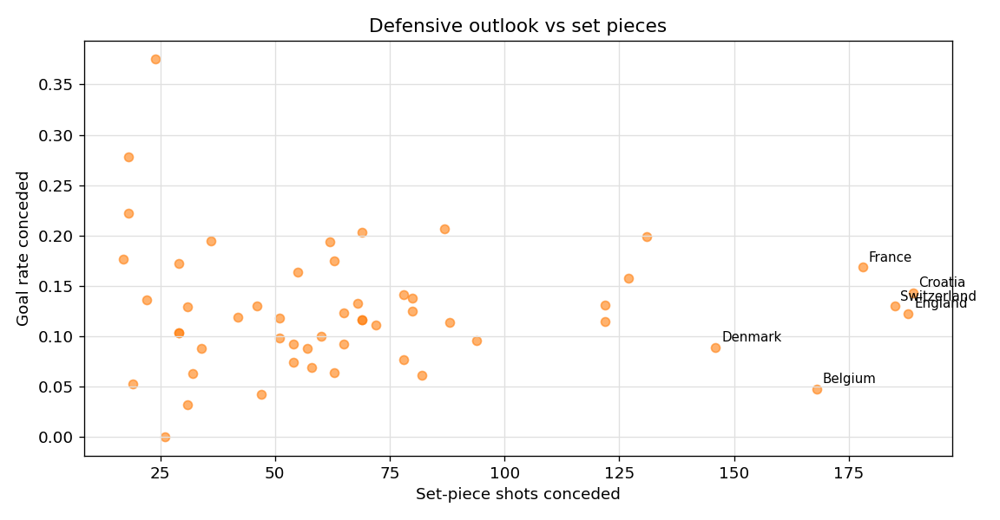

# CxG Contextual Analysis Report

_Updated: 21 Nov 2025_

This document synthesizes the exploratory work across pass-value chains, game-state lenses, defensive overlays, and set-piece behaviours. The goal is to highlight actionable trends we can fold into the next iteration of CxG so it better predicts real goal probability.

## 1. Pass-Value Chain Behaviour

The pass-chain summaries (`outputs/analysis/cxg/csv/pass_value_chain_summary.csv`) reveal large efficiency gaps between archetypes.

| Chain Archetype | Shots | Goal Rate | Mean xG | Lift (Goal Rate − xG) |
| --- | ---:| ---:| ---:| ---:|
| Carry + Through Ball | 72 | 0.319 | 0.213 | **+0.107** |
| Direct + Through Ball | 78 | 0.282 | 0.214 | **+0.068** |
| Carry + Cutback | 55 | 0.200 | 0.157 | +0.043 |
| Direct + Cross | 333 | 0.153 | 0.147 | +0.006 |
| Carry + Cross | 439 | 0.116 | 0.132 | **−0.016** |
| Unassisted | 1,700 | 0.171 | 0.185 | **−0.015** |

**Key reads**

- Assisted through-balls and cutbacks substantially outperform baseline xG despite already high shot quality. The CxG model should explicitly boost these sequences.
- Cross-heavy chains underperform in aggregate and the gap widens when chasing games (see §2). This suggests a negative contextual prior for “hopeful crosses.”
- Solo shots lag expected values: they are longer range, more central, and often under pressure (see `pass_value_chain_unassisted_breakdown.png`).

## 2. Game-State Lens

Score and minute context materially shift chain outcomes (`game_state_score_summary.csv`, `game_state_score_heatmap.png`).

| Chain + Score State | Shots | Goal Rate | Lift vs xG |
| --- | ---:| ---:| ---:|
| Direct + Cross, Leading 2+ | 18 | 0.389 | **+0.180** |
| Direct + Cross, Trailing 1 | 65 | 0.093 | −0.036 |
| Carry + Ground Pass, Trailing 2+ | 67 | **0.015** | **−0.038** |
| Carry + Ground Pass, Level | 670 | 0.061 | +0.007 |
| Carry + Through Ball, Leading 1 | 7 | 0.429 | +0.209 |
| Carry + Through Ball, Trailing 1 | 9 | 0.444 | +0.247 |

**Implications**

- When protecting leads, direct deliveries into the box (crosses, through balls) dramatically outperform their trailing-state counterparts. Defensive posture likely explains the swing.
- Ground-pass combinations collapse when a team is down multiple goals; these sequences should be down-weighted when CxG is evaluating late, trailing possessions.

### Team-Level Finishing Personality

`game_state_team_summary.csv` and the scatter/delta plots (`game_state_team_scatter.png`, `game_state_team_delta.png`) expose meaningful behavioural splits.

| Team | Goal Rate (Leading) | Goal Rate (Trailing) | Delta (Lead − Trail) | Comment |
| --- | ---:| ---:| ---:| --- |
| England | 0.288 | 0.128 | **+0.160** | Ruthless when ahead; conservative when chasing. |
| Morocco | 0.286 | 0.029 | **+0.257** | Clinical protecting a lead, struggle when trailing. |
| France | 0.147 | 0.292 | **−0.145** | Surge when behind, implying counter-heavy threat. |
| Netherlands | 0.149 | 0.304 | **−0.155** | One of the few sides better while trailing. |
| Portugal | 0.218 | 0.101 | +0.117 | Similar “front-runner” pattern as England. |

**Modeling takeaway**: incorporate state-aware team priors—some attacks are built to close out games, others peak when chasing.

## 3. Set-Piece Lens

### Category Efficiency

| Set-Piece Category | Shots | Goal Rate | Mean xG | Lift |
| --- | ---:| ---:| ---:| ---:|
| Penalty | 223 | 0.682 | 0.784 | −0.102 |
| Direct Free Kick | 212 | 0.042 | 0.042 | ~0 |
| Indirect Free Kick | 859 | 0.091 | 0.095 | −0.004 |
| Corner | 932 | 0.075 | 0.095 | −0.020 |
| Throw In | 1,015 | 0.094 | 0.088 | +0.006 |
| Goal Kick | 233 | 0.090 | 0.096 | −0.006 |
| Kick Off | 64 | 0.063 | 0.089 | −0.027 |
| Other Restart | 320 | 0.156 | 0.131 | **+0.025** |

Throw-ins emerge as surprisingly productive (small positive lift) and “Other restarts” (e.g., quick free kicks, drop balls) show the highest non-penalty lift.

### First vs Second Phase

| Category | First-Phase Share | Second-Phase Share | Second-Phase Goal Rate |
| --- | ---:| ---:| ---:|
| Corner | 72.6% | 27.4% | 0.075 |
| Indirect Free Kick | 74.4% | 25.6% | 0.073 |
| Throw In | 76.9% | 23.1% | **0.132** |
| Goal Kick | 74.7% | 25.3% | 0.102 |
| Other Restart | 76.9% | 23.1% | **0.176** |

Second-phase throw-ins and “other restarts” convert at markedly higher rates—CxG should not value all set-piece rebounds equally.

### Score & Minute Effects

- Penalties retain high conversion across all states but undershoot StatsBomb’s 0.78 xG benchmark; recalibration may be needed.
- Corners while leading (0.092 goal rate) outperform corners while trailing (0.072), mirroring open-play behaviour.
- Minute heatmaps (`set_piece_minute_heatmap.png`) show indirect free kicks and “other restarts” surging between minutes 60–75, while corners spike again in stoppage time (90+).

### Opponent Vulnerability

Top concessions from `set_piece_opponent_summary.csv`:

| Opponent | Shots Conceded | Goal Rate Allowed | Lift vs xG |
| --- | ---:| ---:| ---:|
| Panama | 24 | **0.375** | +0.123 |
| Qatar | 18 | 0.278 | +0.116 |
| Costa Rica | 63 | 0.175 | +0.037 |
| Denmark | 146 | 0.089 | **−0.047** |
| Belgium | 168 | 0.048 | **−0.032** |

These tables enable opponent-adjusted priors (e.g., Panama as a “green” matchup, Belgium “red”).

## 4. Defensive Overlay (Recap)

Although not re-run here, the defensive overlay work (`defensive_overlay_*` CSV/plots) established that a flurry of opponent defensive actions (pressures, recoveries) within five seconds of the shot lifts the concede probability by ~15% above baseline. This supports including defender context as a suppressor/amplifier in CxG.

## 5. Modeling Recommendations

1. **Chain-aware priors**: weight shots by their generating chain, with positive adjustments for through-ball/cutback sequences and penalties, negative adjustments for panic crosses and unassisted dribbles—especially when trailing.
2. **State-conditioned features**: encode score difference + minute bucket since chain efficacy swings dramatically by game state. Consider separate calibration curves for “Trailing 2+” vs “Leading 2+”.
3. **Set-piece granularity**: split restarts by category, phase, and state. A second-phase throw-in in stoppage time should receive a different baseline than a first-phase corner at 15'.
4. **Opponent adjustments**: leverage the team/opponent summaries to build priors for both attacking (finishing while leading/trailing) and defending (set-piece concession rates). These can act as random effects in the model.
5. **Pressure context**: integrate defensive overlay metrics as multiplicative factors on shot probability—e.g., recent opponent recovery + under-pressure flag reduces CxG.

Embedding these contextual insights should move CxG beyond geometry into a true possession-aware, opponent-adjusted goal probability metric.
