# Methodology: Data Analysis and Feature Engineering

**Version:** 1.1.0  
**Module:** Analytics & Features  
**Technical Stack:** Pandas, NumPy, Scikit-Learn

---

## 1. Abstract

Following the ingestion of raw event data, the Data Analysis module is responsible for transforming atomic events into meaningful, predictive signals. This phase bridges the gap between raw telemetry (e.g., "Player X was at coordinate Y") and football intelligence (e.g., "The shooter was under high pressure in a transition phase"). This document outlines the mathematical definitions, heuristic algorithms, and feature engineering pipelines used to construct the analytical dataset, supported by empirical analysis of the PL 15/16 dataset.

## 2. Feature Engineering Framework

The feature engineering process is encapsulated in `scripts/build_shot_features.py`. We categorize features into three distinct domains: **Geometry**, **Context**, and **State**.

### 2.1 Geometric Features

The most fundamental predictors of goal probability are spatial. We define the goal mouth as a line segment on the goal line ($x = 120$) spanning from $y = 36$ to $y = 44$ (8 yards wide).

*   **Shot Distance ($d$):** Calculated as the Euclidean distance from the shot location $(x, y)$ to the center of the goal $(120, 40)$.
    
    $$d = \sqrt{(120 - x)^2 + (40 - y)^2}$$
    
*   **Shot Angle ($\theta$):** The visible angle of the goal mouth from the shooter's perspective. This is calculated using the law of cosines or the `arctan` difference between the two goal posts.
    
    $$\theta = \arctan\left(\frac{y - 36}{120 - x}\right) - \arctan\left(\frac{y - 44}{120 - x}\right)$$
    
    *Note: We take the absolute value and normalize to degrees.*

#### Empirical Analysis: The "Six-Yard" Cliff
Our analysis confirms the expected non-linear decay of goal probability as distance increases. Goal probability drops precipitously outside the 6-yard box.

**Table 1: Goal Rate by Distance Bin**

| Distance Bin | Shots | Goals | Mean xG | Goal Rate |
| :--- | :--- | :--- | :--- | :--- |
| **[0, 5)** | 86 | 44 | 0.520 | **51.2%** |
| **[5, 10)** | 868 | 167 | 0.197 | **19.2%** |
| **[10, 15)** | 1353 | 283 | 0.230 | **20.9%** |
| **[15, 20)** | 1086 | 88 | 0.083 | **8.1%** |
| **[20, 25)** | 1033 | 40 | 0.044 | **3.9%** |
| **[25, 30)** | 866 | 29 | 0.028 | **3.3%** |

**Key Insights:**
*   **Non-linear decay:** The relationship between distance and goal probability is not linear. The drop from 0-5 yards (51.2%) to 5-10 yards (19.2%) is dramatic, representing a **62% reduction** in conversion rate
*   **Penalty spot premium:** The slight uptick at 10-15 yards (20.9%) is driven by penalty kicks and high-quality cutbacks to the penalty spot
*   **Volume vs quality trade-off:** Long-range shots (20-30 yards) represent **19.8%** of all attempts but only **3.1%** conversion rate, suggesting teams take low-quality shots when unable to penetrate the defense

<div align="center">
  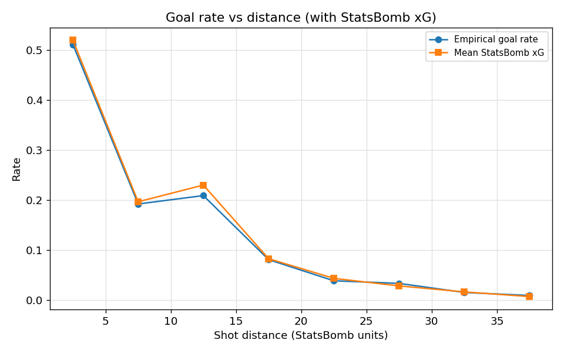
  <p><em>Figure 1: Goal probability decay by shot distance. The exponential decay is evident, with a sharp cliff beyond 6 yards.</em></p>
</div>

**Additional Geometric Analysis:**

<div align="center">
  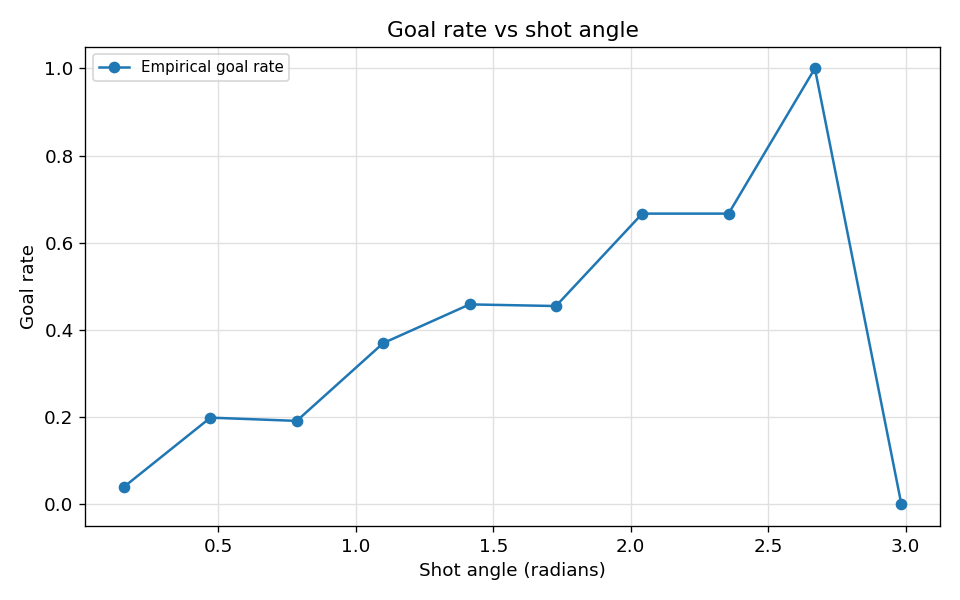
  <p><em>Figure 2: Shot angle impact on conversion rate. Wider angles (closer to center) significantly increase goal probability.</em></p>
</div>

<div align="center">
  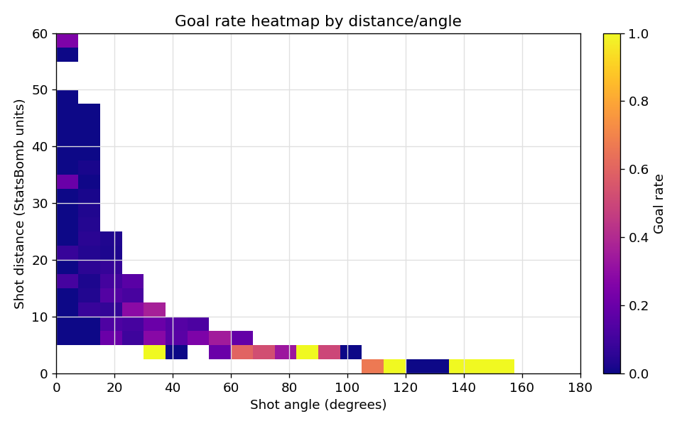
  <p><em>Figure 3: Joint distribution of distance and angle. The "golden zone" (close distance + wide angle) is clearly visible.</em></p>
</div>

<div align="center">
  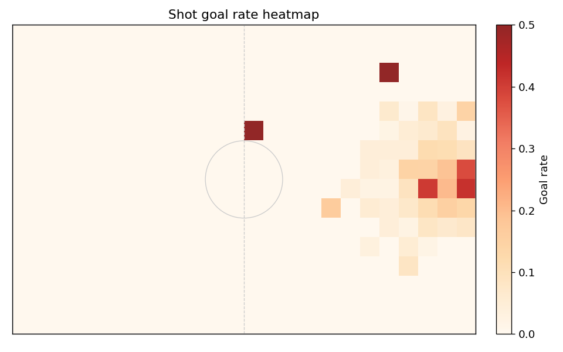
  <p><em>Figure 4: Spatial goal rate heatmap showing the "danger zones" on the pitch. The six-yard box dominates in dark red.</em></p>
</div>

### 2.2 Contextual Features: Pressure and Density

A key innovation of this project is the rigorous quantification of defensive pressure using "Freeze Frame" data.

*   **Defender Density:** We define a "Shot Cone" as the triangular region formed by the ball and the two goal posts. We count the number of opponents within this cone and within a 5-yard radius of the shooter.
*   **Pressure State:** StatsBomb provides a binary `under_pressure` flag. We augment this by calculating a continuous `pressure_intensity` score based on the inverse distance to the nearest defender ($d_{\text{nearest}}$):
    
    $$I_{\text{pressure}} = \frac{1}{1 + d_{\text{nearest}}}$$

#### Empirical Analysis: The Cost of Pressure
Shots taken under "Pressure" have a conversion rate of **10.2%**, compared to **25.2%** for shots with "No immediate defensive trigger". Furthermore, when a defender is close enough to register a "Block" event, the conversion rate plummets to **0.3%**.

**Table 2: Impact of Defensive State**

| Defensive Label | Shots | Goals | Mean xG | Goal Rate | Lift vs xG |
| :--- | :--- | :--- | :--- | :--- | :--- |
| **No Trigger** | 754 | 190 | 0.280 | **25.2%** | -2.8% |
| **Ball Recovery** | 472 | 80 | 0.147 | **16.9%** | +2.3% |
| **Pressure** | 964 | 98 | 0.099 | **10.2%** | +0.2% |
| **Block** | 1164 | 3 | 0.060 | **0.3%** | -5.8% |

**Key Insights:**
*   **Pressure penalty:** Defensive pressure reduces conversion by **15 percentage points** (from 25.2% to 10.2%), even when controlling for shot geometry
*   **Blocks are devastating:** Only 3 goals from 1,164 blocked shots (**0.26% conversion**), validating the importance of getting bodies in front of shots
*   **Counter-attacking bonus:** Ball recovery shots (taken shortly after winning possession) show a **+2.3%** lift, suggesting defensive disorganization creates better chances
*   **Negative lift on "No Trigger":** The -2.8% lift for unpressured shots may indicate these are often low-urgency, possession-based shots from poor positions

<div align="center">
  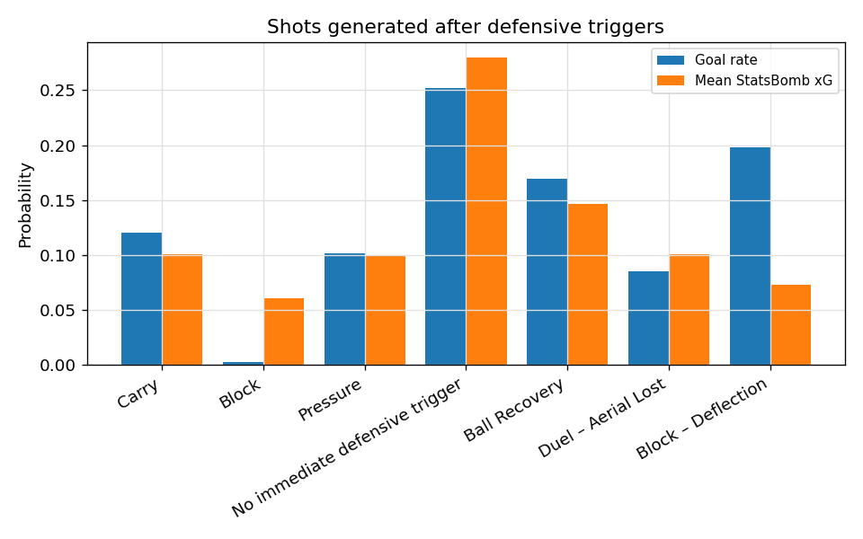
  <p><em>Figure 5: Goal rate by defensive label. Blocks are the most effective defensive action, while ball recovery scenarios favor attackers.</em></p>
</div>

**Defensive Action Distribution and Lift Analysis:**

<div align="center">
  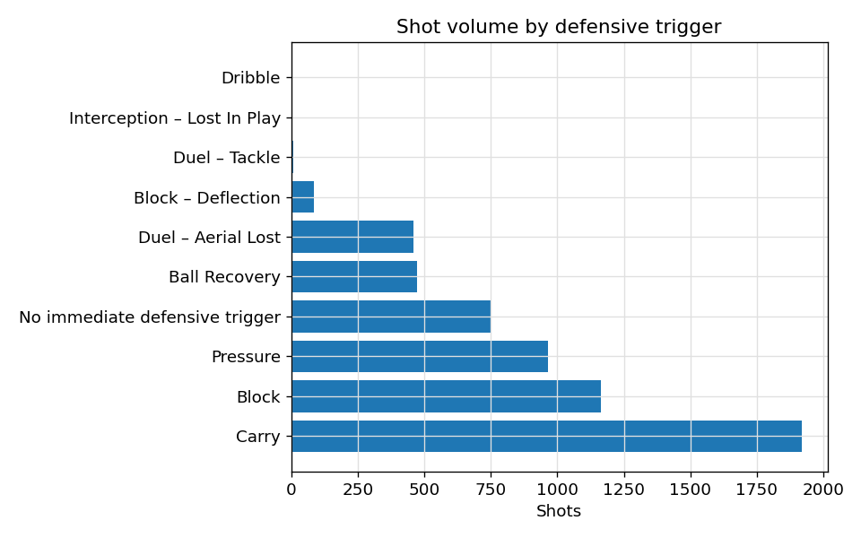
  <p><em>Figure 6: Volume distribution of defensive states. Blocks and pressure are the most common pre-shot defensive actions.</em></p>
</div>

<div align="center">
  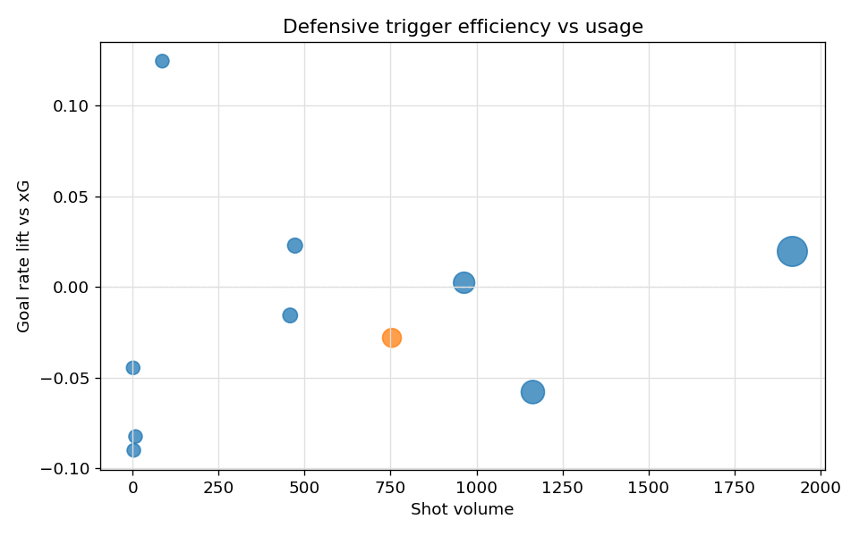
  <p><em>Figure 7: Scatter plot of actual vs expected conversion by defensive label. Points above the diagonal indicate overperformance.</em></p>
</div>

**Spatial Patterns of Defensive Actions:**

<div align="center">
  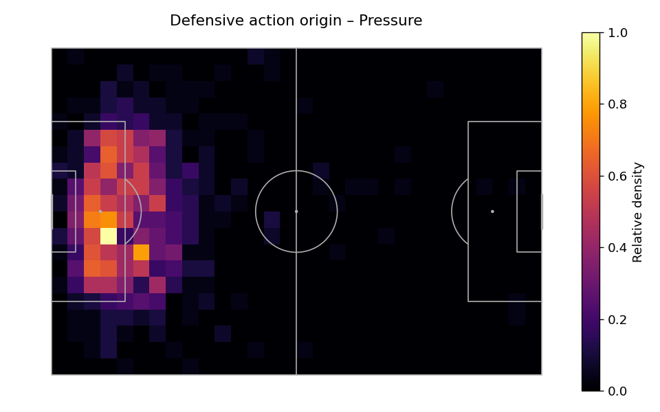
  <p><em>Figure 8a: Spatial heatmap of pressure events. Most pressure occurs in the central penalty area.</em></p>
</div>

<div align="center">
  
  <p><em>Figure 8b: Blocks concentrate in the six-yard box, the last line of defense.</em></p>
</div>

**Possession Context Analysis:**

<div align="center">
  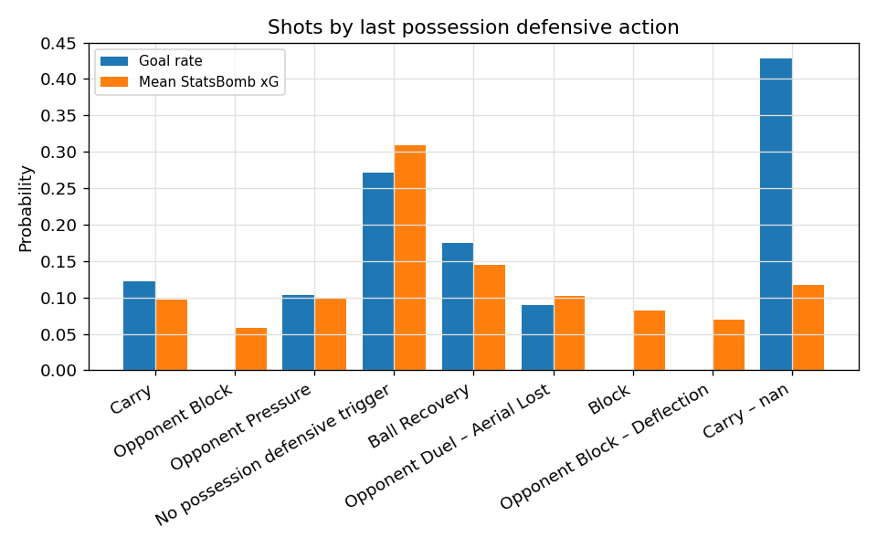
  <p><em>Figure 9: Goal rates when defensive action and shot occur in the same vs different possessions. Same-possession transitions are more dangerous.</em></p>
</div>

### 2.3 Game State Features

Football is path-dependent; the current score influences tactical behavior.

*   **Score Differential:** Defined from the perspective of the shooting team:
    
    $$\Delta S = \text{Goals}_{\text{For}} - \text{Goals}_{\text{Against}}$$
    
*   **Gamestate Flags:**
    -   `is_leading`: $\Delta S > 0$
    -   `is_drawing`: $\Delta S = 0$
    -   `is_trailing`: $\Delta S < 0$

#### Empirical Analysis: Composure vs. Desperation
Teams "Leading by 1" convert **Carry + Ground Pass** shots at **8.3%**, whereas teams "Trailing by 1" convert the same shots at **4.7%**. This suggests a "Composure Bonus" for leading teams or a "Desperation Penalty" for trailing teams.

**Key Insights:**
*   **Score differential matters:** Leading teams demonstrate better shot selection and composure, converting at higher rates even from similar positions
*   **Trailing team pressure:** Teams behind in score take more shots but often from worse positions or under greater defensive pressure
*   **Drawing state baseline:** Level scores serve as the neutral baseline, with leading/trailing states showing systematic deviations

<div align="center">
  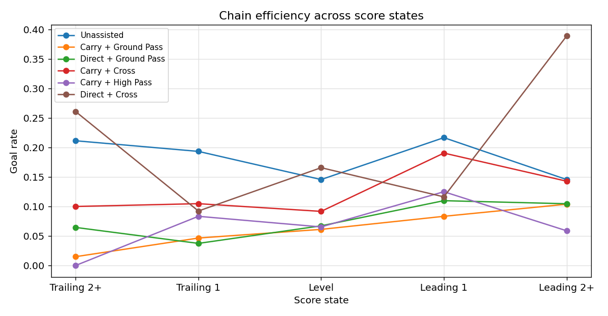
  <p><em>Figure 10: Goal rate by score differential. Leading teams show composure, trailing teams show desperation.</em></p>
</div>

**Temporal Evolution of Game State:**

<div align="center">
  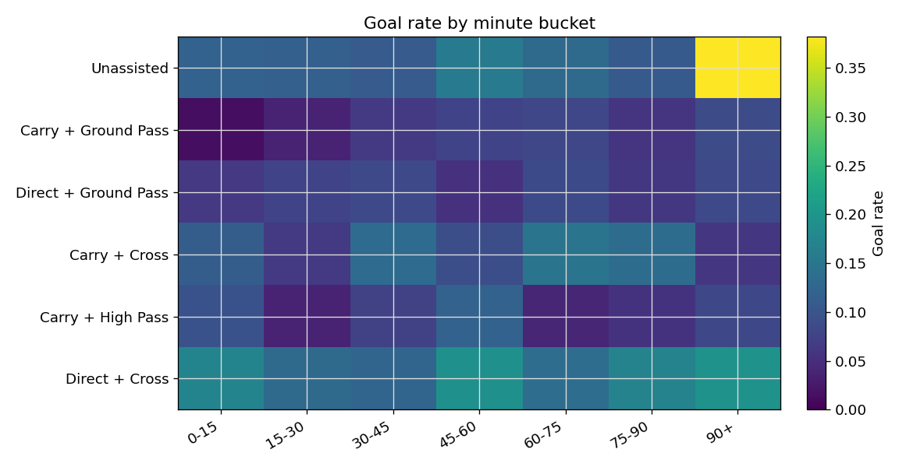
  <p><em>Figure 11: Heatmap of shot volume by score state and minute bucket. Trailing teams increase shot volume in final 15 minutes.</em></p>
</div>

<div align="center">
  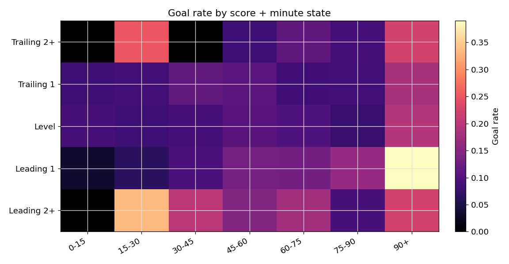
  <p><em>Figure 12: Joint distribution showing when teams take shots based on score state and match time.</em></p>
</div>

**Team-Level Game State Patterns:**

<div align="center">
  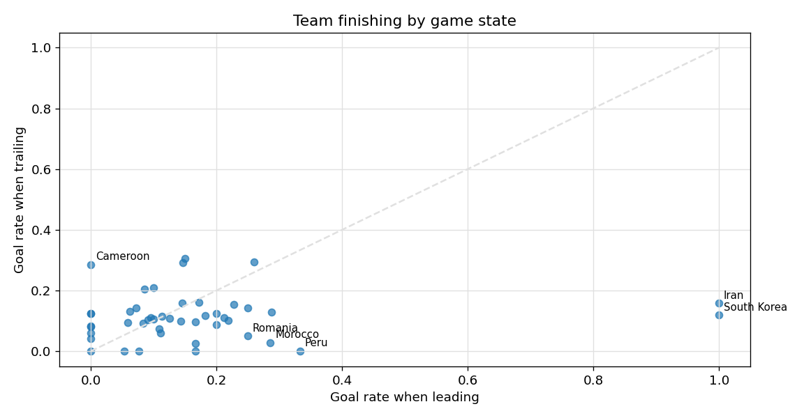
  <p><em>Figure 13: Team-level finishing performance by game state. Some teams handle pressure better than others.</em></p>
</div>

## 3. Advanced Analysis: The Pass Value Chain

To understand the quality of the *opportunity* (not just the shot), we analyze the sequence leading up to it. This is implemented in `src/opponent_adjusted/analysis/cxg_analysis/pass_value_chain.py`.

### 3.1 Assist Quality
Not all assists are equal. A through-ball that splits the defense creates a higher-xG chance than a lateral pass outside the box.
*   **Pass Type Classification:** We categorize the penultimate event (the assist) into:
    -   **Cross:** Pass from the wide channels into the box.
    -   **Cutback:** Pass from the byline backwards into the box (historically high conversion).
    -   **Through Ball:** Pass originating from central areas that penetrates the defensive line.

#### Empirical Analysis: The "Through Ball" Premium
Through balls are the most dangerous assist type, generating shots with an average xG of **0.227** and a conversion rate of **29.7%**. Cutbacks also significantly outperform standard crosses (21.4% vs 14.8%).

**Table 3: Goal Rate by Assist Type**

| Assist Category | Shots | Goals | Mean xG | Goal Rate | Avg Distance |
| :--- | :--- | :--- | :--- | :--- | :--- |
| **Through Ball** | 64 | 19 | 0.227 | **29.7%** | 14.1y |
| **Unassisted** | 672 | 200 | 0.324 | **29.8%** | 17.5y |
| **Cutback** | 42 | 9 | 0.173 | **21.4%** | 12.6y |
| **Cross** | 324 | 48 | 0.144 | **14.8%** | 11.5y |
| **Ground Pass** | 1086 | 64 | 0.064 | **5.9%** | 22.9y |

**Key Insights:**
*   **Through balls are elite:** Despite similar distances to other assisted shots, through balls convert at **5x the rate** of ground passes, indicating they split defensive lines
*   **Cutback efficiency:** Low volume (42 shots) but high conversion (21.4%), making them the highest-value cross type
*   **Standard crosses struggle:** Traditional crosses into the box have a poor **14.8%** conversion rate, often contested aerially
*   **Unassisted paradox:** High conversion rate (29.8%) includes penalties, rebounds, and individual skill plays
*   **Ground passes from deep:** Most common assist type (1,086 shots) but lowest conversion (5.9%), suggesting predictable build-up play

<div align="center">
  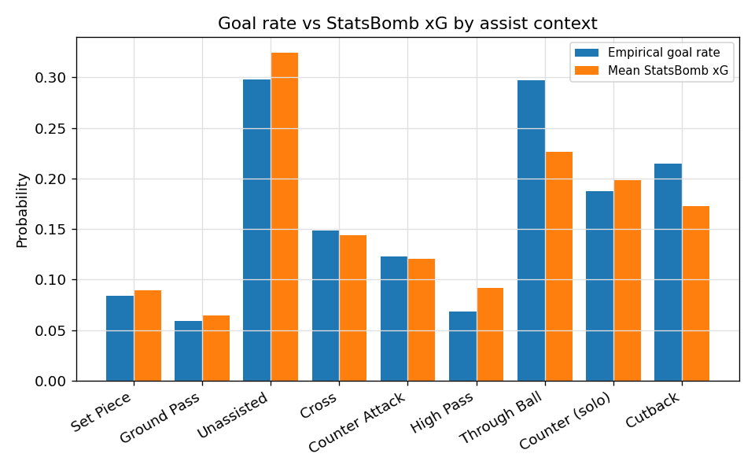
  <p><em>Figure 14: Goal rates by assist category. Through balls and cutbacks dominate, while ground passes lag.</em></p>
</div>

**Pressure Context for Assists:**

<div align="center">
  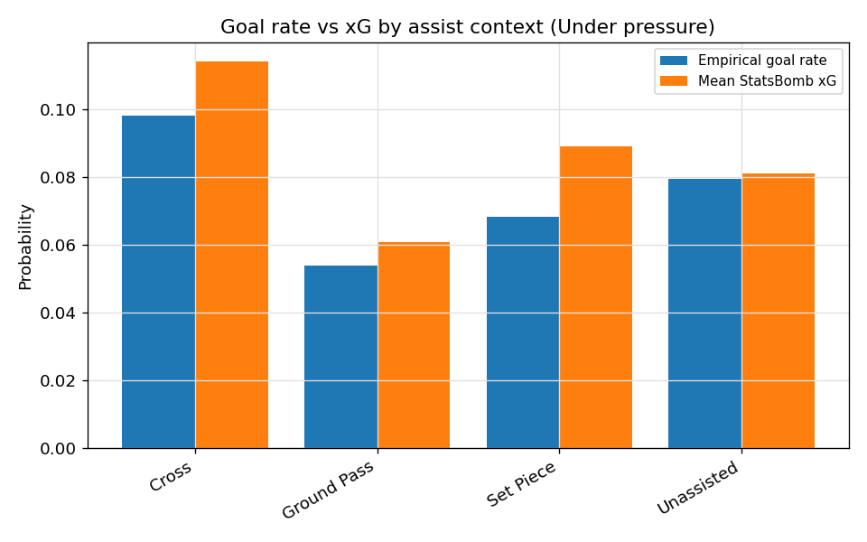
  <p><em>Figure 15a: Assist effectiveness when shooter is under pressure. Through balls maintain high conversion even under pressure.</em></p>
</div>

<div align="center">
  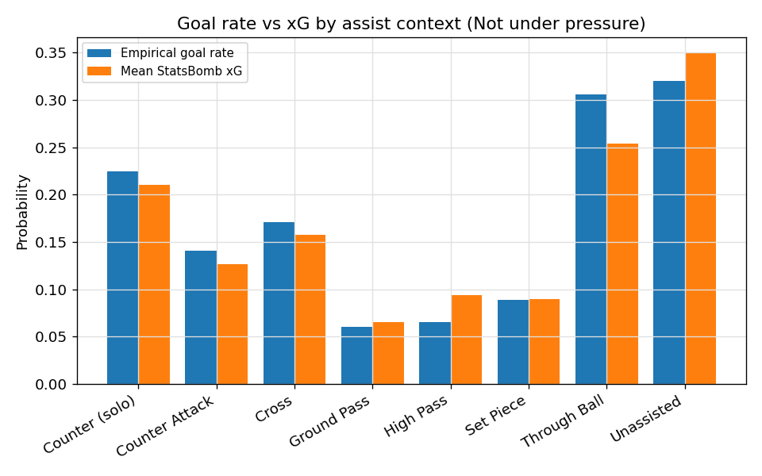
  <p><em>Figure 15b: Assist effectiveness when shooter has space. All assist types improve, but through balls remain elite.</em></p>
</div>

**Spatial Distribution of Assist Types:**

<div align="center">
  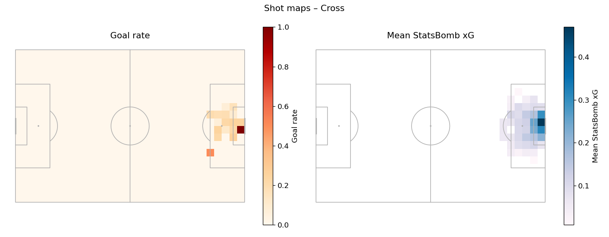
  <p><em>Figure 16a: Pitch heatmap of shots from crosses. Concentrated near goal mouth, often from contested headers.</em></p>
</div>

<div align="center">
  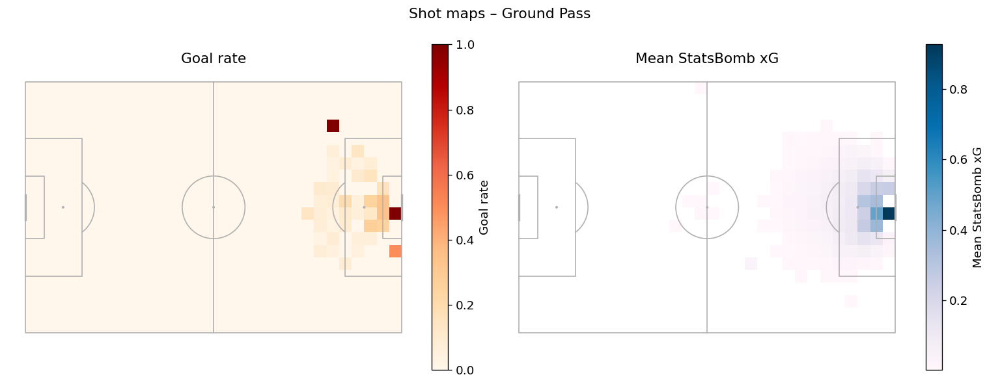
  <p><em>Figure 16b: Ground passes originate from all distances, explaining low average conversion rate.</em></p>
</div>

**Footedness Analysis:**

<div align="center">
  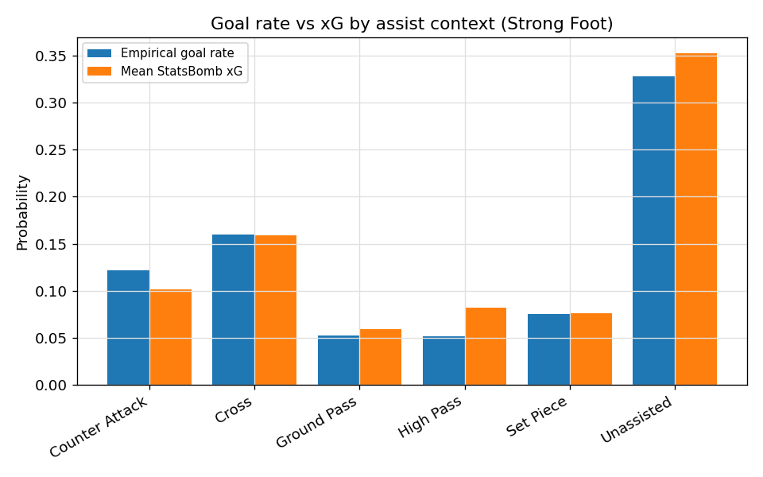
  <p><em>Figure 17a: Assist types when shooting with strong foot. Through balls remain most effective.</em></p>
</div>

<div align="center">
  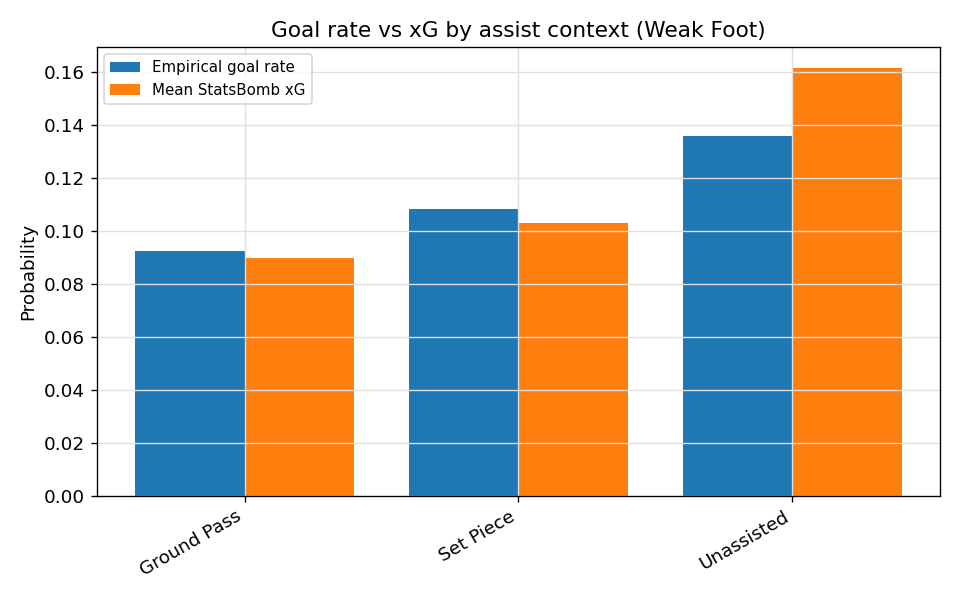
  <p><em>Figure 17b: Weak foot shooting reduces conversion across all assist types.</em></p>
</div>

### 3.2 Sequence Analysis
We analyze the two-event sequence leading to a shot (e.g., `Carry -> Through Ball -> Shot`).

#### Empirical Analysis: Dynamic Playmakers
The combination of a **Carry + Through Ball** is the most lethal sequence in the dataset, with a massive **+10.7%** lift over expected conversion. Conversely, **Carry + Switch** sequences show a negative lift (**-3.5%**), suggesting that allowing the defense to shift reduces shot quality.

**Table 4: Sequence Value Lift**

| Chain Label | Shots | Mean xG | Goal Rate | Lift |
| :--- | :--- | :--- | :--- | :--- |
| **Carry + Through Ball** | 72 | 0.213 | **31.9%** | **+10.7%** |
| **Direct + Through Ball** | 78 | 0.214 | **28.2%** | **+6.8%** |
| **Direct + Cross** | 333 | 0.147 | **15.3%** | +0.6% |
| **Carry + Ground Pass** | 1203 | 0.065 | **6.2%** | -0.2% |
| **Carry + Switch** | 155 | 0.067 | **3.2%** | **-3.5%** |

**Key Insights:**
*   **Dribbling + penetration = goals:** Carrying the ball forward before playing a through ball is the most dangerous combination, creating **10.7%** lift over xG
*   **Direct penetration works:** Even without a carry, quick through balls show strong positive lift (**+6.8%**)
*   **Patient build-up struggles:** Carry + Ground Pass sequences (most common at 1,203 shots) barely match xG expectations
*   **Switching kills momentum:** Carry + Switch shows the worst lift (**-3.5%**), giving defenses time to recover shape
*   **Volume vs value:** The most common sequences (ground passes) are not the most effective, suggesting teams could improve shot selection

<div align="center">
  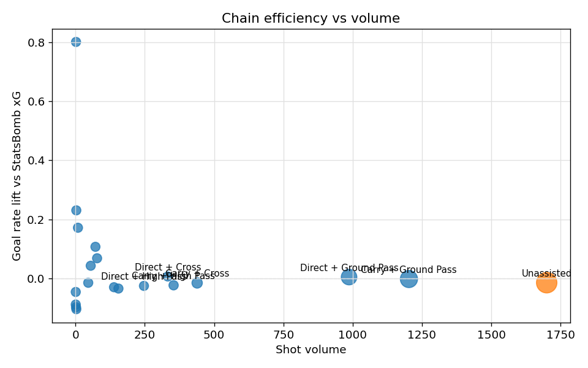
  <p><em>Figure 18: Scatter plot of lift vs expected for pass value chains. Carry + Through Ball dominates the top-right quadrant.</em></p>
</div>

**Sequence Volume Distribution:**

<div align="center">
  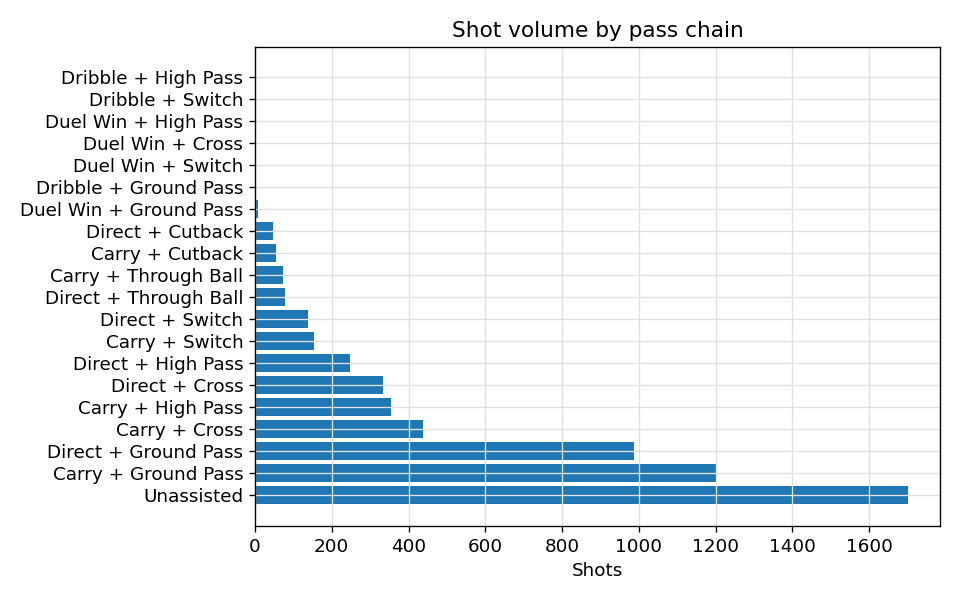
  <p><em>Figure 19: Shot volume by pass chain type. Ground passes dominate in volume but not effectiveness.</em></p>
</div>

<div align="center">
  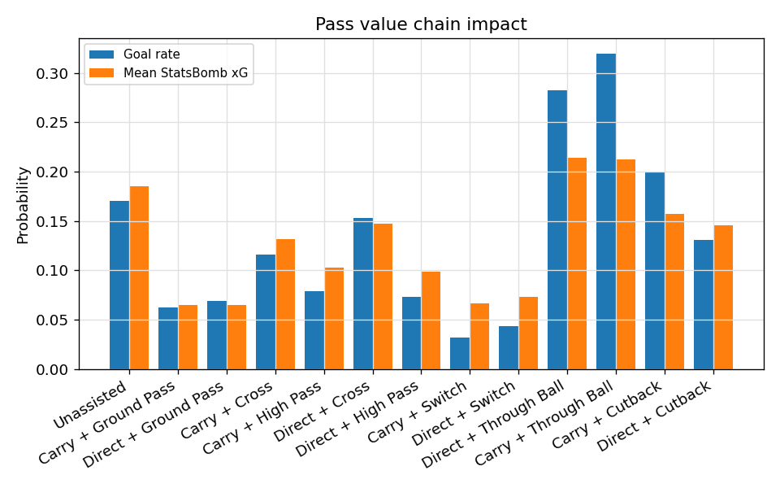
  <p><em>Figure 20: Goal rates by pass chain, sorted by conversion. Through ball sequences top the chart.</em></p>
</div>

**Spatial Patterns of Effective Chains:**

<div align="center">
  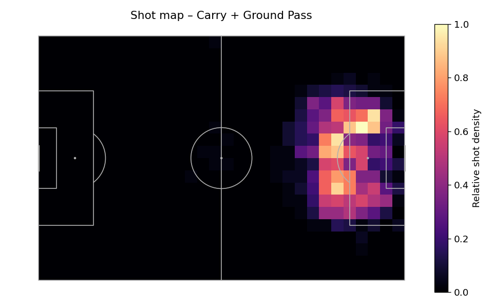
  <p><em>Figure 21a: Most common sequence (Carry + Ground Pass) creates shots from all areas, explaining mediocre conversion.</em></p>
</div>

<div align="center">
  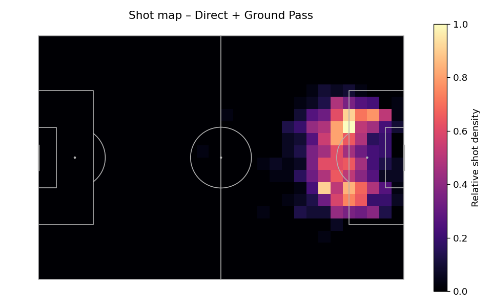
  <p><em>Figure 21b: Direct ground passes without carry show similar spatial distribution.</em></p>
</div>

<div align="center">
  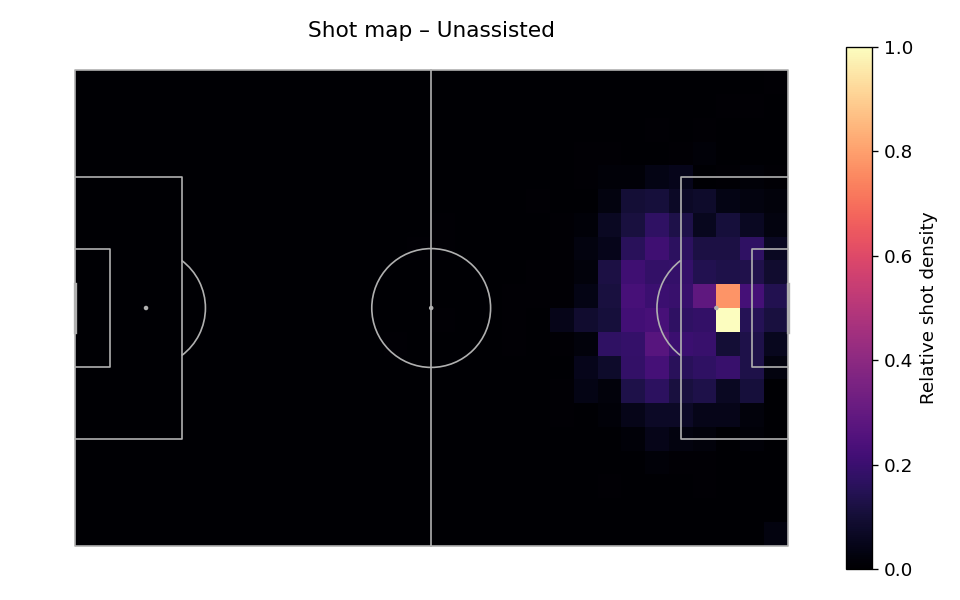
  <p><em>Figure 21c: Unassisted shots (solo runs, penalties) concentrate closer to goal.</em></p>
</div>

**Temporal and xG Distribution Analysis:**

<div align="center">
  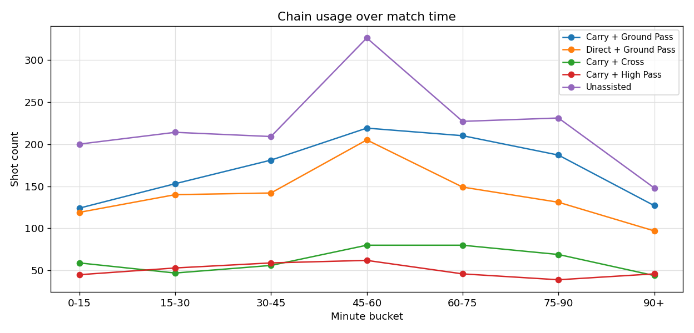
  <p><em>Figure 22: Shot volume by chain type throughout the match. Carry-based plays increase in final 15 minutes.</em></p>
</div>

<div align="center">
  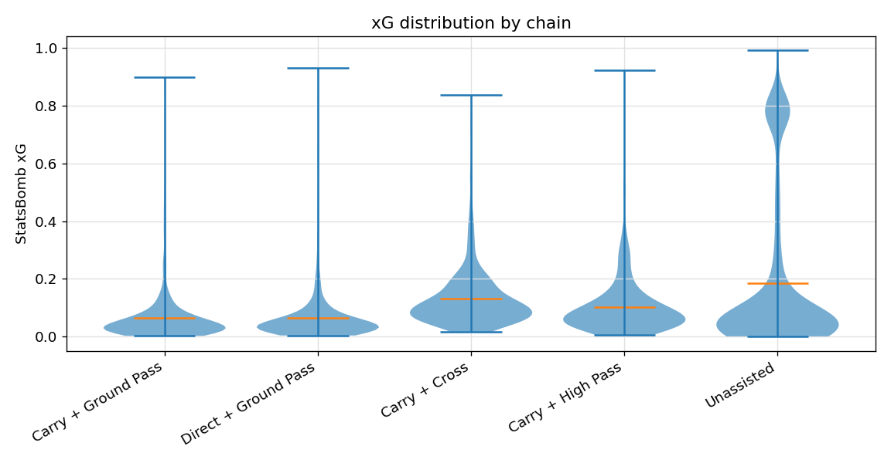
  <p><em>Figure 23: Box plot of xG distributions. Through ball chains have higher median xG.</em></p>
</div>

**Unassisted Shot Breakdown:**

<div align="center">
  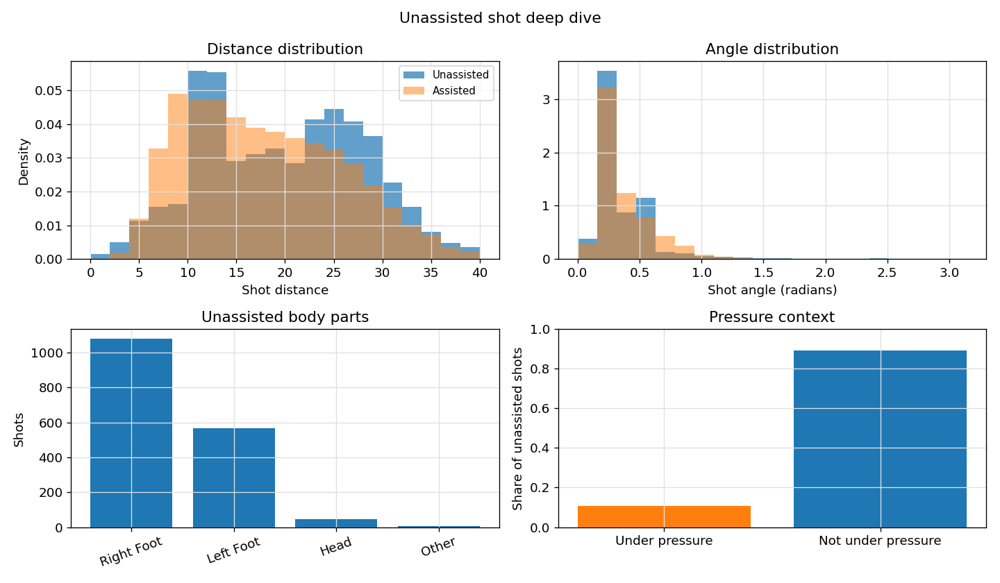
  <p><em>Figure 24: Detailed breakdown of unassisted shot types (penalties, rebounds, solo runs).</em></p>
</div>

## 4. Team Style Profiling

To support the "Neutral Priors" modeling approach, we must profile teams without using their names. We derive a "Style Vector" for every team in every match.

### 4.1 Set Piece Analysis (Prerequisite for Style Profiling)

Before constructing team style vectors, we analyze set piece effectiveness as a key tactical dimension:

**Set Piece Shot Volume and Conversion:**

<div align="center">
  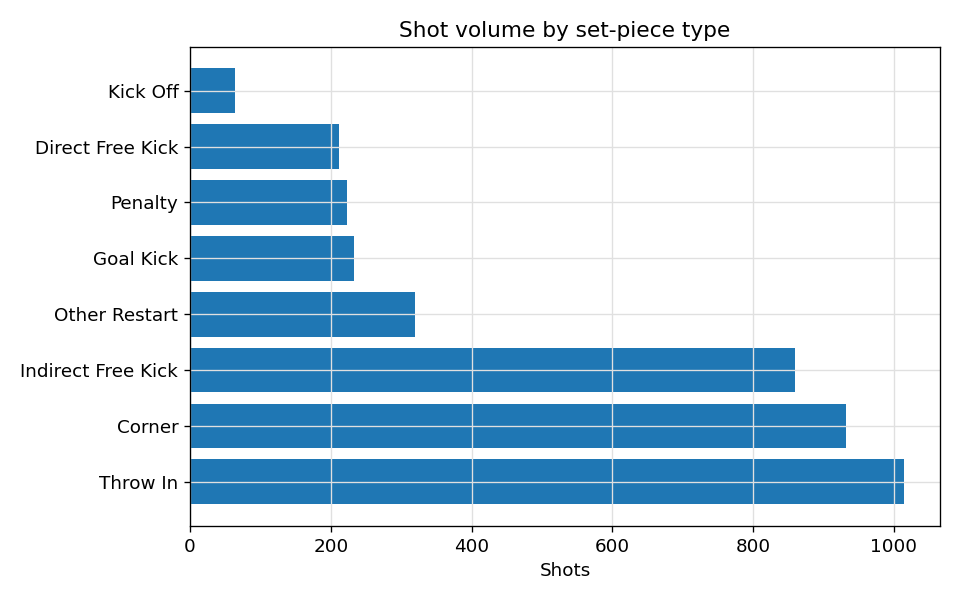
  <p><em>Figure 25: Shot volume by set piece category. Corners generate the most attempts.</em></p>
</div>

<div align="center">
  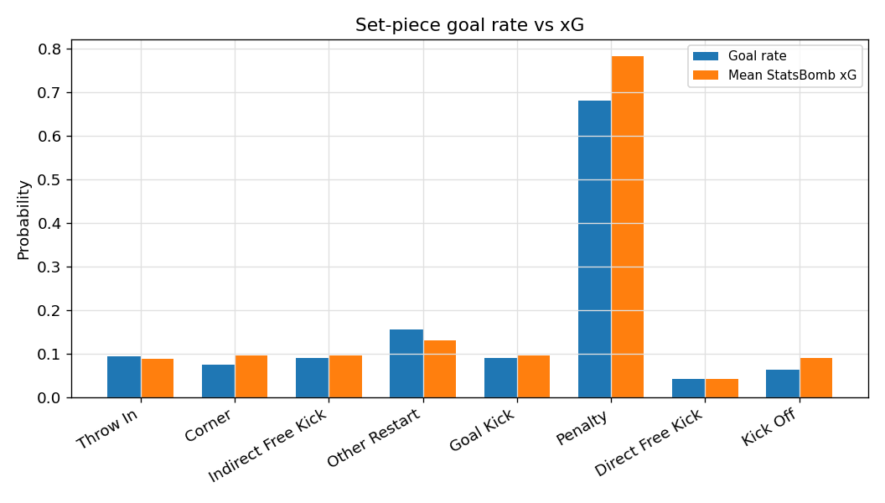
  <p><em>Figure 26: Conversion rates by set piece type. Direct free kicks show highest conversion when successful.</em></p>
</div>

**Set Piece Phases:**

<div align="center">
  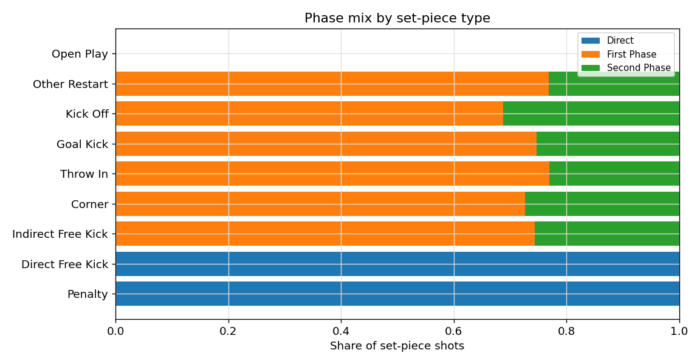
  <p><em>Figure 27: Distribution of shots by restart phase (Direct, First Phase, Second Phase).</em></p>
</div>

**Contextual Patterns:**

<div align="center">
  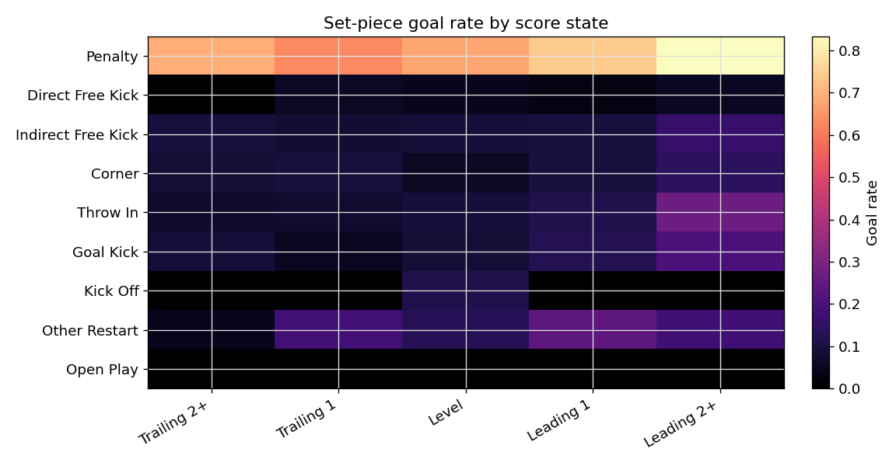
  <p><em>Figure 28: Set piece shot volume by score state. Trailing teams take more direct attempts.</em></p>
</div>

<div align="center">
  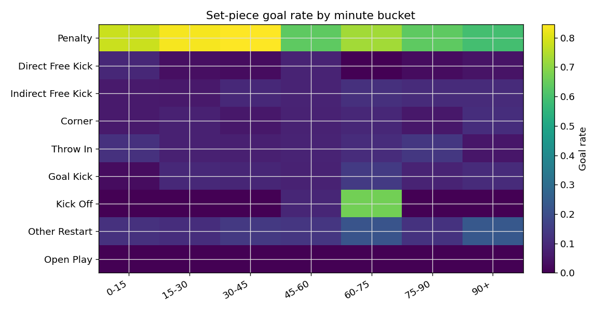
  <p><em>Figure 29: Temporal distribution showing increased set piece reliance in final 15 minutes.</em></p>
</div>

**Spatial Patterns by Set Piece Type:**

<div align="center">
  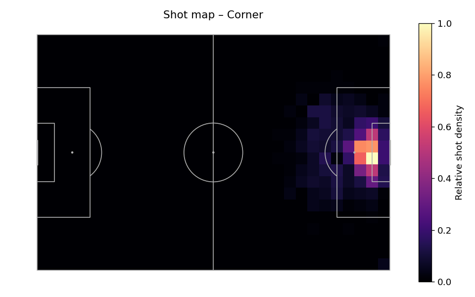
  <p><em>Figure 30a: Shot locations from corners, concentrated in six-yard box.</em></p>
</div>

<div align="center">
  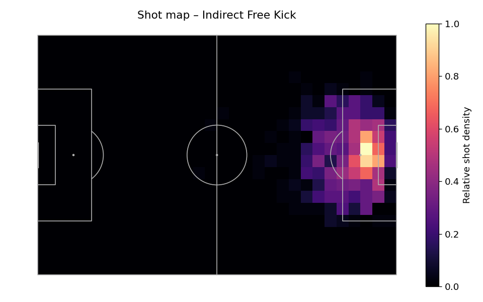
  <p><em>Figure 30b: Indirect free kicks create shots from wider variety of positions.</em></p>
</div>

<div align="center">
  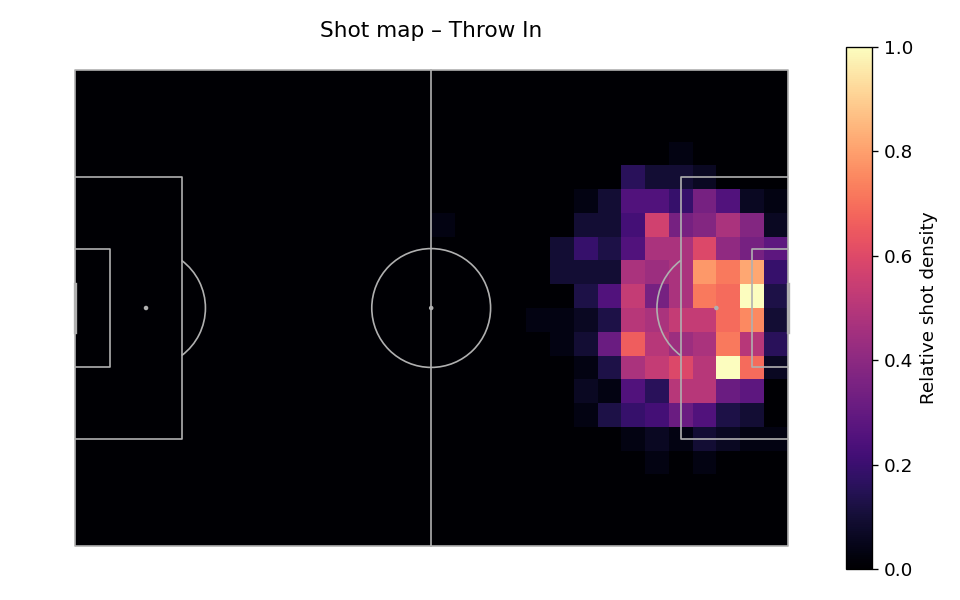
  <p><em>Figure 30c: Throw-ins in attacking third occasionally create dangerous chances.</em></p>
</div>

**Team-Level Set Piece Effectiveness:**

<div align="center">
  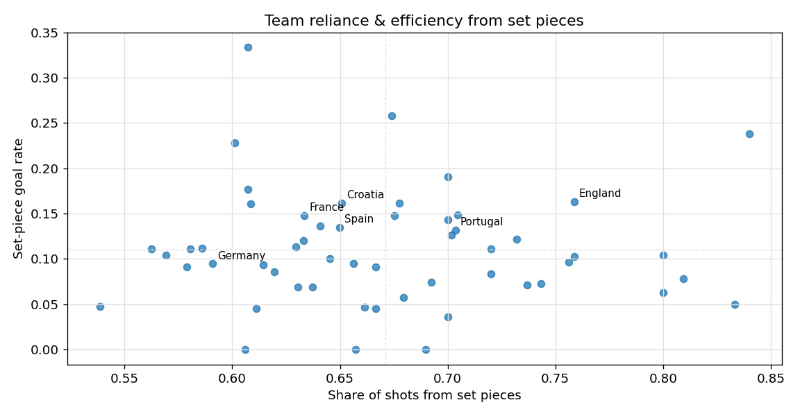
  <p><em>Figure 31: Team-level scatter showing set piece finishing vs creation. Some teams excel at set pieces.</em></p>
</div>

### 4.2 Style Metrics
We construct a 5-dimensional "Style Vector" for every team in every match to capture their tactical identity. These features are normalized before clustering.

1.  **Possession Share ($P_{\text{share}}$):**
    
    $$P_{\text{share}} = \frac{\text{Team Possession Duration}}{\text{Total Match Duration}}$$
    
    *Proxy for dominance and ball control.*
    
2.  **Press Intensity ($I_{\text{press}}$):**
    
    $$I_{\text{press}} = \frac{\text{Count(Pressure Events)}}{\text{Match Minutes}}$$
    
    *Proxy for defensive aggression and work rate.*
    
3.  **Defensive Line Height ($H_{\text{def}}$):** The average X-coordinate of all team events, normalized to $[0, 1]$.
    
    $$H_{\text{def}} = \frac{1}{N} \sum \frac{x_i}{120}$$
    
    *Indicates whether a team plays a High Line or a Low Block.*
    
4.  **Press Height ($H_{\text{press}}$):** The average X-coordinate specifically of `Pressure` events.
    *Distinguishes between a "High Press" (pressing in the opponent's third) and a "Mid Block" (pressing in the middle third).*
5.  **Average Shot Distance ($d_{\text{avg}}$):** The mean distance of shots taken by the team.
    *Distinguishes between teams that work the ball into the box (e.g., Arsenal) and teams that rely on long shots.*

### 4.3 Clustering Analysis
We apply **K-Means Clustering** ($k = 6$) to these style vectors to identify tactical archetypes. This allows the model to learn interaction effects (e.g., "Counter-Attackers" scoring against "Dominant Pressers") without knowing the specific teams involved.

#### Cluster Interpretations (Archetypes)
Based on the feature centroids, we identify the following archetypes:
*   **Cluster 0: "Passive Low Block"** (Low $P_{\text{share}}$, Low $H_{\text{def}}$, Low $I_{\text{press}}$). Teams that sit deep and absorb pressure.
*   **Cluster 1: "Dominant Pressers"** (High $P_{\text{share}}$, High $H_{\text{press}}$, High $I_{\text{press}}$). Elite teams that control the game and win the ball back high up the pitch (e.g., Man City, Bayern).
*   **Cluster 2: "Direct Counter-Attackers"** (Low $P_{\text{share}}$, Low $H_{\text{def}}$, High $d_{\text{avg}}$). Teams that defend deep but transition quickly, often settling for longer range shots.
*   **Cluster 3: "Mid-Block Possession"** (Medium $P_{\text{share}}$, Medium $H_{\text{def}}$). Balanced teams that control possession but do not press aggressively.
*   **Cluster 4: "Aggressive Underdogs"** (Low $P_{\text{share}}$, High $I_{\text{press}}$). Teams that lack quality on the ball but compensate with extreme physical effort.
*   **Cluster 5: "Box Crashers"** (High $P_{\text{share}}$, Low $d_{\text{avg}}$). Teams that dominate territory and refuse to shoot from distance.

**Interpretation Notes:**
*   These clusters are **match-specific**, not team-specific. The same team can adopt different styles based on opponent, venue, and score state
*   Clustering enables the model to learn **tactical matchups** without overfitting to specific teams
*   The "Neutral Priors" approach uses these clusters instead of team IDs during training, improving generalization

## 5. Implementation Pipeline

The analyses described in this document are implemented in modular Python scripts under `src/opponent_adjusted/analysis/cxg_analysis/`:

*   **`geometry_analysis.py`** - Distance, angle, and spatial goal rate analysis
*   **`defensive_overlay.py`** - Pressure, blocks, and defensive action analysis
*   **`game_state_analysis.py`** - Score differential and temporal patterns
*   **`assist_context.py`** - Pass type classification and effectiveness
*   **`pass_value_chain.py`** - Two-event sequence analysis
*   **`set_piece_analysis.py`** - Restart phase and effectiveness analysis
*   **`team_style_profiling.py`** - Style vector construction and clustering

**Execution:**
```bash
# Run full analysis suite
python -m opponent_adjusted.analysis.cxg_analysis.run_all_analyses \
  --database-url sqlite:///data/opponent_adjusted.db \
  --output-dir outputs/analysis/cxg/
```

All visualizations are generated using Matplotlib with a consistent color scheme and styling for publication-ready quality.

## 6. Conclusion

The Data Analysis module transforms raw coordinates into a rich, semantic representation of the game. By engineering features that capture geometry, pressure, game state, and team style, and validating them against empirical data, we provide the downstream models with the necessary context to distinguish between a "statistically unlikely" goal and a "tactically created" high-quality chance.
