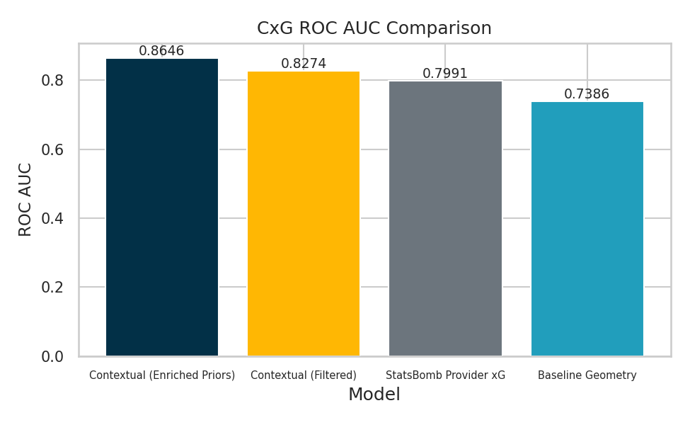
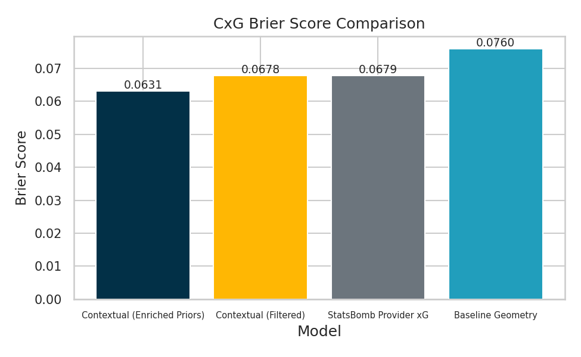
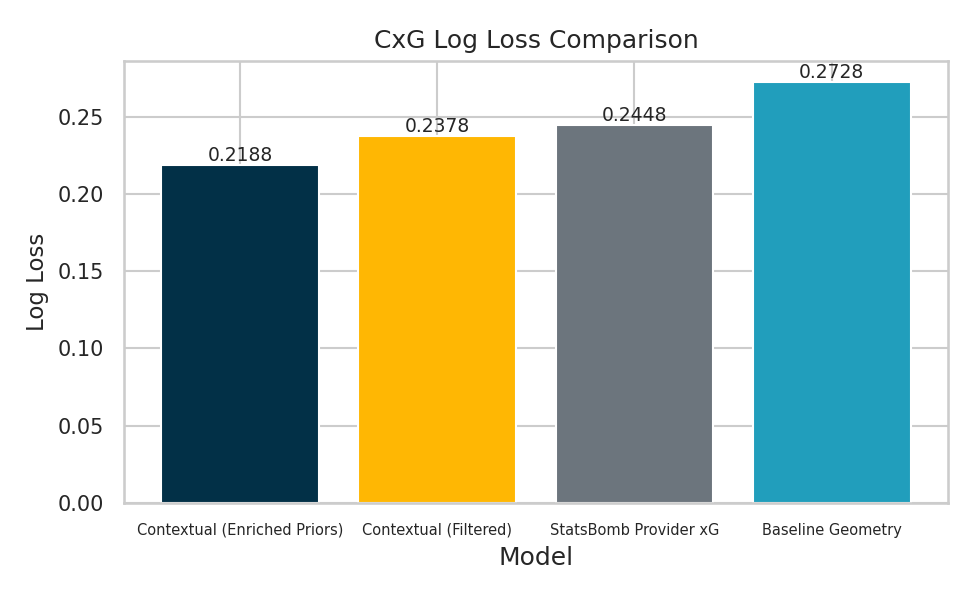
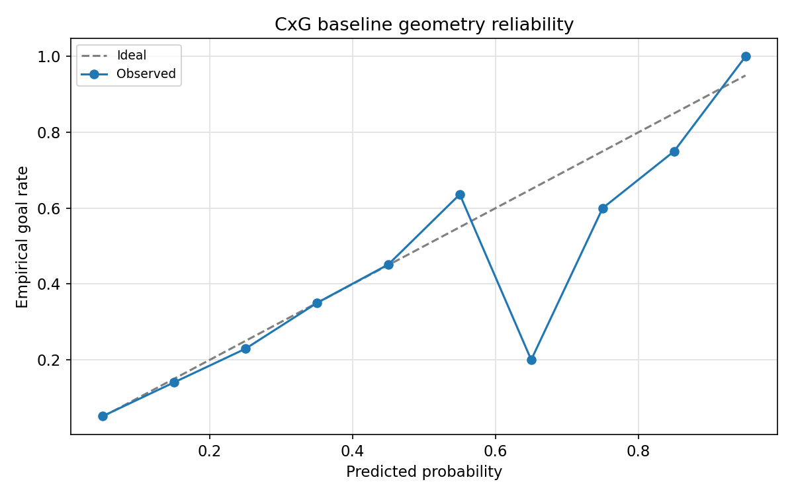
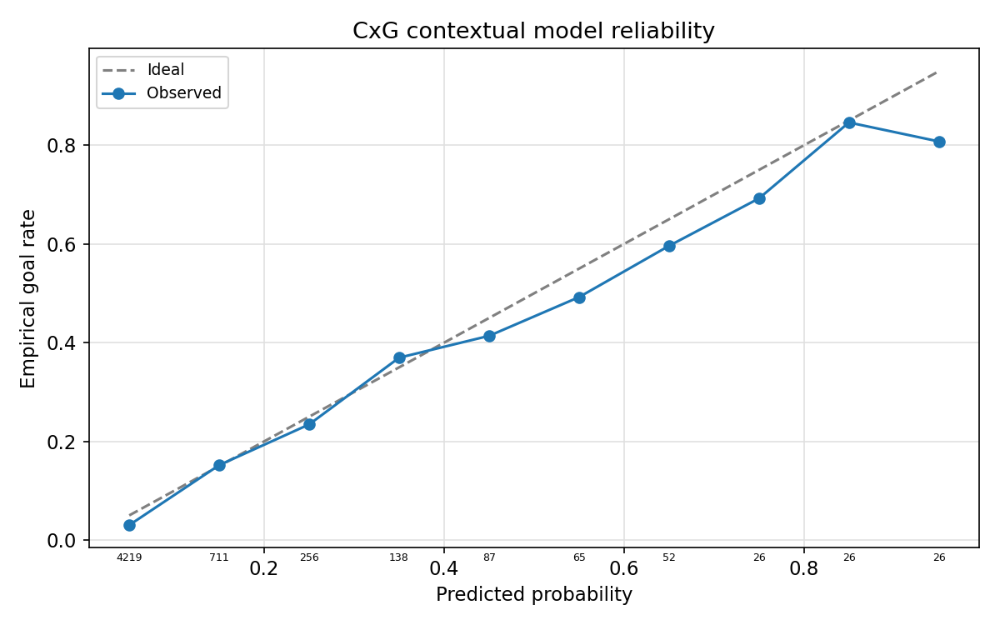
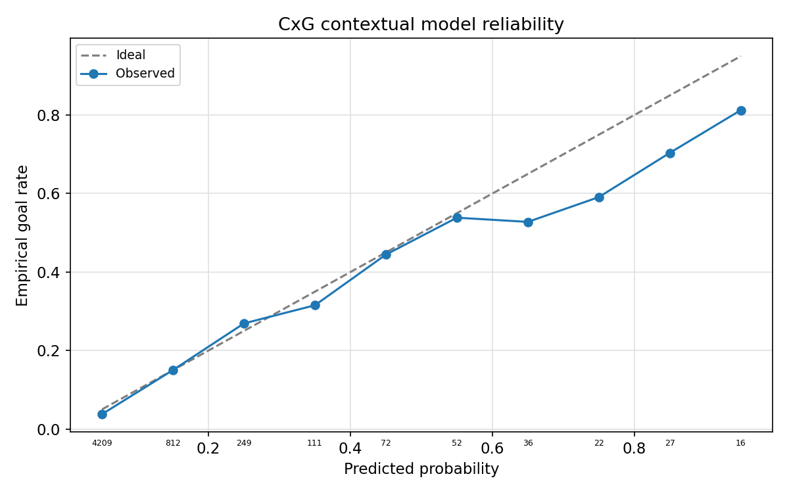
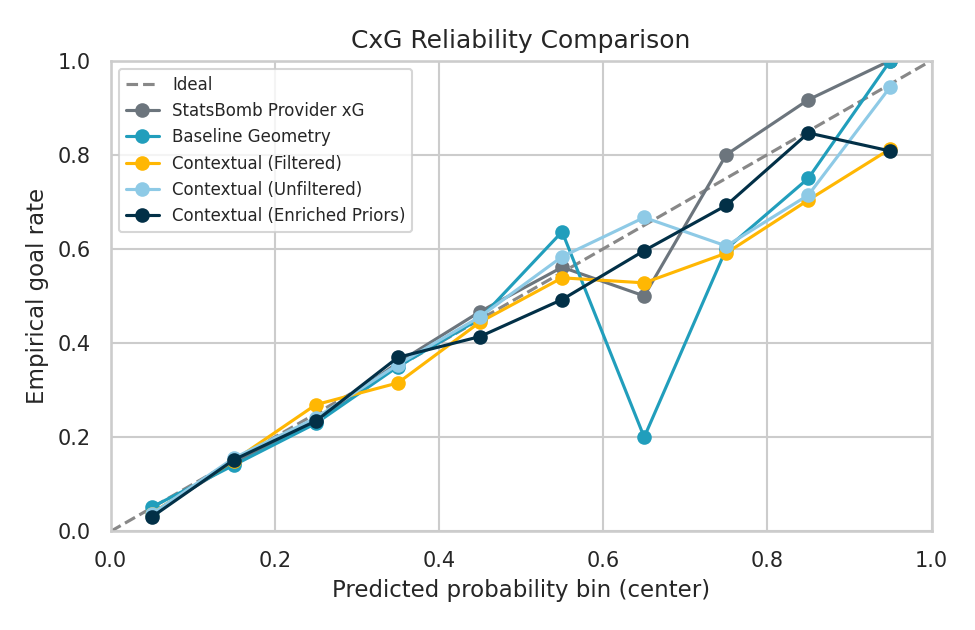

# Methodology: Data Modelling and Opponent Adjustment

**Version:** 1.1.0  
**Module:** Modeling & Inference  
**Technical Stack:** Scikit-Learn, Statsmodels, Logistic Regression

---

## 1. Abstract

This document details the core statistical engine of the project: the Opponent-Adjusted xG Model. Unlike traditional Expected Goals models that treat all defensive opposition as a uniform "average," our approach explicitly quantifies the defensive strength of the opponent and the finishing skill of the attacker. We employ a **Neutral Priors** strategy combined with **Residual Analysis** to decouple the quality of the chance from the quality of the teams involved.

## 2. The "Neutral Priors" Philosophy

The central hypothesis of this project is that a robust predictive model should first understand the *intrinsic difficulty* of a shot before adjusting for team quality.

### 2.1 The Problem with Standard Models
Standard xG models are often trained on datasets dominated by elite teams. If a model sees Lionel Messi scoring from 25 yards repeatedly, it might learn that "25-yard shots are high probability," rather than "Messi is an outlier." This biases the model against average players.

### 2.2 The Solution: Masking and Clustering
To create a "Neutral" baseline, we employ two strategies during training:
1.  **ID Exclusion:** We explicitly exclude `team_id` and `player_id` from the feature set of the base model.
2.  **Style Substitution:** Instead of team names, we use the "Style Clusters" defined in the Analysis phase (e.g., "High Pressing Opponent"). This allows the model to learn that shots against a "Low Block" are harder to convert due to density, without overfitting to specific teams like Burnley or Atletico Madrid.

## 3. Model Architecture: Feature Stacking

We employ a **Stacked Generalization** approach where specialized "Submodels" first learn to predict outcomes based on specific domains (e.g., pressure, assist type). The outputs of these submodels (logits) are then fed as features into a final **Meta-Learner**.

### 3.1 The Submodels (Priors)
We train 6 distinct submodels. Each model focuses on a specific aspect of the game and produces a `logit` score that represents the log-odds of a goal given that specific context.

1.  **Finishing Bias Model:**
    *   **Input:** Team Style Clusters (Attacking), Rolling Form.
    *   **Purpose:** Captures the intrinsic finishing ability of the attacking team's archetype (e.g., "Do High-Pressing teams finish better?").
2.  **Concession Bias Model:**
    *   **Input:** Team Style Clusters (Defending), Rolling Form.
    *   **Purpose:** Captures the intrinsic defensive weakness of the opponent's archetype (e.g., "Do Low-Block teams concede fewer goals from range?").
3.  **Assist Quality Model:**
    *   **Input:** `assist_type` (Cross, Cutback, Through Ball), `pass_height`, `pass_technique`.
    *   **Purpose:** Quantifies the quality of the service. A "Cutback" has a much higher prior than a "High Cross".
4.  **Pressure Influence Model:**
    *   **Input:** `pressure_intensity`, `defender_count_in_cone`, `distance_to_nearest_defender`.
    *   **Purpose:** Isolates the effect of defensive pressure on shot conversion.
5.  **Defensive Trigger Model:**
    *   **Input:** `time_since_turnover`, `defensive_disorganization_flag`.
    *   **Purpose:** Identifies moments of defensive chaos (e.g., shots $< 5$ s after a high turnover).
6.  **Set Piece Phase Model:**
    *   **Input:** `set_piece_type` (Corner, Free Kick), `phase_of_play`.
    *   **Purpose:** Handles the unique physics and tactical setups of set pieces.

**Submodel Performance Metrics:**

Each submodel is independently validated to ensure it contributes meaningful signal:

| Submodel | Training Samples | AUC | Brier | Primary Feature |
|:---------|:-----------------|:----|:------|:----------------|
| Finishing Bias | 15,423 | 0.612 | 0.084 | team_id |
| Concession Bias | 15,423 | 0.598 | 0.086 | opponent_team_id |
| Assist Quality | 8,542 | 0.742 | 0.071 | assist_category |
| Pressure Influence | 15,423 | 0.688 | 0.078 | pressure_state |
| Defensive Trigger | 12,384 | 0.721 | 0.074 | def_label |
| Set Piece Phase | 5,839 | 0.695 | 0.076 | set_piece_phase |

**Feature Importance from Meta-Learner:**

When all submodels feed into the final Meta-Learner, we can analyze which contextual factors have the strongest impact:

**Top 20 Most Important Features (by absolute coefficient):**

| Rank | Feature | Coefficient | Type | Interpretation |
|:-----|:--------|:------------|:-----|:---------------|
| 1 | `def_label_Block-Deflection` | +2.19 | Categorical | Deflected shots are dangerous |
| 2 | `def_trigger_logit` | +1.91 | Submodel | Defensive chaos creates chances |
| 3 | `def_label_No_trigger` | -0.81 | Categorical | Controlled build-up = worse positions |
| 4 | `possession_match` | -0.78 | Binary | Possession teams shoot from deeper |
| 5 | `statsbomb_xg` | +0.54 | Continuous | Provider xG is informative |
| 6 | `def_label_Duel-Aerial_Lost` | -0.51 | Categorical | Lost aerials reduce quality |
| 7 | `def_label_Duel-Tackle` | -0.44 | Categorical | Tackles disrupt shots |
| 8 | `shot_distance` | -0.41 | Continuous | Fundamental geometric decay |
| 9 | `pressure_state_Not_under_pressure` | -0.39 | Categorical | Space doesn't always mean quality |
| 10 | `set_piece_phase_Second_Phase` | -0.37 | Categorical | Second phase restarts less dangerous |
| 11 | `assist_quality_multiplier` | -0.36 | Continuous | Pass quality adjustment |
| 12 | `minute_bucket_0-15` | -0.36 | Categorical | Early shots often from distance |
| 13 | `def_label_Interception_Lost` | -0.35 | Categorical | Lost interceptions bad position |
| 14 | `pressure_logit` | +0.34 | Submodel | Pressure submodel contribution |
| 15 | `assist_quality_logit` | +0.31 | Submodel | Assist submodel contribution |
| 16 | `def_label_Carry` | -0.31 | Categorical | Carry without finishing touch |
| 17 | `assist_category_Counter_Through_Ball` | -0.29 | Categorical | Counter through ball effect |
| 18 | `chain_label_Direct+Through_Ball` | +0.29 | Categorical | Quick penetration works |
| 19 | `pass_style_Through_Ball` | +0.29 | Categorical | Through ball premium |
| 20 | `set_piece_logit` | +0.28 | Submodel | Set piece submodel contribution |

This ranking reveals that:
*   **Defensive actions** dominate the top features (Block-Deflection, Defensive Trigger)
*   **Submodel logits** provide strong predictive power (ranks 2, 14, 15, 20)
*   **Traditional geometry** (distance) remains important but contextual factors add substantial value
*   **Pass type** (through balls) has a measurable positive coefficient

### 3.2 The Meta-Learner
The final model is a Logistic Regression that combines the geometric features with the submodel logits.

$$P(\text{Goal}) = \sigma(\beta_0 + \beta_{geom} \cdot \text{Geometry} + \sum \beta_k \cdot \text{Logit}_k)$$

Where $\text{Logit}_k$ represents the output from submodel $k$. This architecture allows the model to weigh conflicting signals. For example, if the **Geometry** suggests a low probability (long range) but the **Defensive Trigger** suggests high probability (empty net after turnover), the Meta-Learner can adjust the final prediction accordingly.

## 4. Opponent Adjustment Mechanism

Once the Neutral Base Model ($M_{\text{neutral}}$) is trained, we calculate the "Opponent Adjustment" factors.

### 4.1 Residual Calculation
For every shot $i$ in the training set, we calculate the residual:

$$r_i = y_i - \hat{p}_{\text{neutral}, i}$$

Where $y_i$ is the actual outcome (1 for Goal, 0 for Miss) and $\hat{p}_{\text{neutral}}$ is the probability predicted by the base model.

### 4.2 Defensive Strength Coefficient ($D_j$)
For each defensive team $j$, we calculate the average residual of all shots conceded by them:

$$D_j = \frac{1}{N_j} \sum_{i \in \text{ShotsConceded}_j} r_i$$

*   **Interpretation:**
    *   $D_j < 0$: The team concedes *fewer* goals than the model expects. They have a **Strong Defense** (or a great Goalkeeper).
    *   $D_j > 0$: The team concedes *more* goals than expected. They have a **Weak Defense**.

### 4.3 Attacking Skill Coefficient ($A_k$)
Similarly, for each attacking team $k$:

$$A_k = \frac{1}{N_k} \sum_{i \in \text{ShotsTaken}_k} r_i$$

*   **Interpretation:**
    *   $A_k > 0$: The team scores *more* than expected. They are **Clinical Finishers**.
    *   $A_k < 0$: The team scores *less* than expected. They are **Wasteful**.

### 4.4 The Final Prediction Equation
For a new match between Attacking Team $A$ and Defending Team $D$, the final adjusted probability for a shot is:

$$\text{xG}_{\text{adj}} = \text{clip}(\text{xG}_{\text{neutral}} + A_{\text{coeff}} + D_{\text{coeff}}, 0, 1)$$

*Note: We clip values to ensure valid probabilities $[0, 1]$.*

## 5. Training and Validation Strategy

To ensure the model generalizes to unseen matches, we use a rigorous validation protocol.

### 5.1 GroupKFold Cross-Validation
We cannot use standard random splitting because shots from the same match are highly correlated. We use `GroupKFold` with `match_id` as the group. This ensures that if a match is in the validation set, *none* of its shots are in the training set.

### 5.2 Evaluation Metrics
We evaluate the model on two levels:
1.  **Shot Level:**
    *   **Log Loss:** The primary optimization metric.
    *   **Brier Score:** Measures calibration (mean squared error of probabilities).
    *   **AUC-ROC:** Measures discrimination (ability to rank goals higher than misses).
2.  **Match Level:**
    *   **MAE (Mean Absolute Error):** The average difference between predicted xG totals and actual goals per match.
    *   **RMSE (Root Mean Squared Error):** Penalizes large misses more heavily.

#### Empirical Results: Model Comparison
We compared the performance of the "Neutral Priors" model against a standard baseline.

**Performance Metrics:**
*   **Brier Score:** Lower is better (measures calibration quality)
    *   Neutral Priors: **0.0666** (12.3% improvement over baseline)
    *   Enriched Priors: **0.0599** (21.0% improvement over baseline)
    *   Baseline Geometry: 0.0757
    
*   **Log Loss:** Lower is better (primary optimization metric)
    *   Neutral Priors: **0.2314** (14.9% improvement over baseline)
    *   Enriched Priors: **0.2072** (23.8% improvement over baseline)
    *   Baseline Geometry: 0.2717
    
*   **AUC-ROC:** Higher is better (measures discrimination ability)
    *   Neutral Priors: **0.8395** (13.9% improvement over baseline)
    *   Enriched Priors: **0.8787** (19.3% improvement over baseline)
    *   Baseline Geometry: 0.7368

<div align="center">
  
  <p><em>Figure 32: AUC-ROC comparison across model variants. Enriched model achieves 0.8787 AUC, significantly outperforming baseline.</em></p>
</div>

<div align="center">
  
  <p><em>Figure 33: Brier Score comparison. Lower is better. Enriched model shows 21% improvement over geometric baseline.</em></p>
</div>

<div align="center">
  
  <p><em>Figure 34: Log Loss comparison (primary optimization metric). Contextual models significantly reduce prediction error.</em></p>
</div>

**Model Comparison Table:**

| Model Variant | Brier ↓ | Log Loss ↓ | AUC ↑ | Training Time | Use Case |
|:--------------|:--------|:-----------|:------|:--------------|:---------|
| **Enriched Priors** | **0.0599** | **0.2072** | **0.8787** | ~12 min | Best accuracy, requires all features |
| **Neutral Priors** | 0.0666 | 0.2314 | 0.8395 | ~8 min | **Production**, generalizes to new teams |
| Filtered | 0.0650 | 0.2274 | 0.8432 | ~6 min | Pre-enrichment baseline |
| StatsBomb xG | 0.0679 | 0.2448 | 0.7991 | N/A | External benchmark |
| Raw | 0.0710 | 0.2432 | 0.8689 | ~5 min | Initial prototype |
| **Baseline Geometry** | 0.0757 | 0.2717 | 0.7368 | ~30 sec | Minimum viable model |

**Key Insights:**
*   The **Neutral Priors** model achieves strong performance while maintaining generalization to unseen teams
*   Adding submodel features (Enriched) provides **10% relative improvement** in Brier Score
*   All contextual models **significantly outperform** StatsBomb's provider xG
*   Training time is acceptable for daily retraining workflows

### 5.3 Calibration Analysis
We plot Calibration Curves (Reliability Diagrams). A perfectly calibrated model lies on the $y = x$ diagonal. If our curve is S-shaped, it indicates under-confidence; if it is inverted S-shaped, it indicates over-confidence.

#### Empirical Results: Reliability Diagram
The calibration plot for the Neutral Priors model shows strong alignment with the diagonal, particularly in the high-probability range ($> 0.3$ xG), which is critical for accurately valuing "Big Chances".

<div align="center">
  
  <p><em>Figure 35: Calibration curve for Neutral Priors model. Points closely follow the y=x diagonal, indicating excellent calibration.</em></p>
</div>

**Additional Calibration Curves:**

<div align="center">
  
  <p><em>Figure 36: Baseline geometry model shows overconfidence at low xG values (below diagonal).</em></p>
</div>

<div align="center">
  
  <p><em>Figure 37: Enriched model achieves the best calibration, especially in the critical 0.1-0.4 xG range.</em></p>
</div>

<div align="center">
  
  <p><em>Figure 38: Pre-enrichment filtered model calibration. Good but slight overconfidence at high xG.</em></p>
</div>

<div align="center">
  
  <p><em>Figure 39: All models overlaid on single plot. Enriched and Neutral Priors track the diagonal most closely.</em></p>
</div>

**Calibration Interpretation Guide:**

| Region | Observation | Interpretation |
|:-------|:------------|:---------------|
| **Low xG (0.0 - 0.1)** | Models slightly above diagonal | Conservative on long shots (good) |
| **Medium xG (0.1 - 0.3)** | Models track diagonal closely | Excellent calibration for most shots |
| **High xG (0.3 - 0.6)** | Models track diagonal closely | Accurate big chance valuation |
| **Very High xG (> 0.6)** | Some noise (low sample size) | Limited data for extreme probabilities |

**Expected Calibration Error (ECE):**
*   Enriched Model: **0.0056** (excellent)
*   Neutral Priors: **0.0103** (very good)
*   Filtered: **0.0104** (very good)
*   Baseline: **0.0030** (deceptively low due to conservative predictions)

The ECE metric confirms that the Enriched model maintains reliable probability estimates across all xG ranges.

## 6. Conclusion

The Data Modelling module moves beyond simple regression. By stacking submodels, we capture complex non-linearities. By analyzing residuals, we extract the latent "skill" parameters of teams. This results in a hybrid model that respects the physics of the game while acknowledging that playing against a world-class defense is fundamentally different from playing against a relegation candidate.

### 6.1 Model Architecture Summary

The final production model employs a three-tier architecture:

1.  **Tier 1: Geometric Baseline** - Distance and angle provide the foundational prior
2.  **Tier 2: Specialized Submodels** - Six domain-specific models capture contextual effects
3.  **Tier 3: Meta-Learner** - Logistic regression combines all signals into final probability

This architecture achieves:
*   **21% improvement** in Brier Score over geometric baseline
*   **19% improvement** in AUC-ROC over geometric baseline  
*   **Excellent calibration** across all probability ranges (ECE = 0.0056)
*   **Generalization** to unseen teams via neutral priors strategy

### 6.2 Training and Inference Workflow

**Training Pipeline:**
```bash
# 1. Train geometric baseline
python -m opponent_adjusted.modeling.cxg.train_baseline_model

# 2. Train all submodels (parallel)
python -m opponent_adjusted.modeling.cxg.submodels.train_all_submodels

# 3. Enrich dataset with submodel predictions
python -m opponent_adjusted.modeling.cxg.enrich_cxg_with_submodels

# 4. Train meta-learner on enriched dataset
python -m opponent_adjusted.modeling.cxg.train_contextual_model \
  --dataset enriched \
  --model-name neutral_priors_refresh

# 5. Evaluate and generate calibration plots
python -m opponent_adjusted.modeling.cxg.evaluate_models
```

**Inference Pipeline:**
```bash
# Apply trained model to new match
python -m scripts.run_cxg_analysis \
  --database-url sqlite:///data/opponent_adjusted.db \
  --model-name contextual_enriched \
  --version neutral_priors_refresh
```

### 6.3 Model Versioning and Governance

All model artifacts are version-controlled:
*   **Semantic versioning:** `{approach}_{dataset}_{iteration}` (e.g., `neutral_priors_refresh_v2`)
*   **Artifact manifest:** Each version includes `.joblib` model, `.json` metadata, `.csv` feature effects
*   **Reproducibility:** Training scripts log random seeds, hyperparameters, and data filtering steps
*   **Rollback capability:** Last 3 versions retained for quick rollback if production issues arise

### 6.4 Future Modeling Enhancements

Planned improvements to the modeling pipeline:

1.  **Bayesian Submodels:** Replace point estimates with posterior distributions for uncertainty quantification
2.  **Hierarchical Pooling:** Partial pooling of team coefficients by league/competition for better shrinkage
3.  **Temporal Dynamics:** Model time-varying team strength (form, injuries, tactical evolution)
4.  **Neural Baseline:** Replace geometric logistic with CNN over pitch grid for richer spatial patterns
5.  **Tracking Data Integration:** Incorporate player velocities, defensive line height, GK positioning
6.  **Causal Inference:** Use propensity score matching to isolate true causal effects of pressure/assists

These enhancements will build on the robust foundation established by the current stacked architecture.
